# IAM 7.3.0 Performance Test Results

During each release, we execute various automated performance test scenarios and publish the results.
This document will be helpful for capacity planning as it reflects realistic user scenarios.

The results cover **four node configurations** — Single Node 4 Core, Two Node 4 Core, Three Node 4 Core, and Four Node 4 Core — all using `c6i.xlarge` EC2 instances.

| Test Scenario | Description |
|---|---|
| OIDC Auth Code Grant Redirect With Consent | Obtain an access token and an id token using the OAuth 2.0 authorization code grant type. |
| OIDC Auth Code Grant Redirect Without Consent | Obtain an access token and an id token using the OAuth 2.0 authorization code grant type without consent. |
| OIDC Auth Code Grant Redirect Without Consent Retrieving User Attributes | Obtain an access token and an id token using the OAuth 2.0 authorization code grant type without consent. Retrieve country, email, first name and last name as user attributes. |
| OIDC Auth Code Grant Redirect Without Consent Retrieving User Attributes, Groups and Roles | Obtain an access token and an id token using the OAuth 2.0 authorization code grant type without consent. Retrieve country, email, first name and last name as user attributes. Additionally retrieve groups and roles as well. |
| SAML2 SSO Redirect Binding | Obtain a SAML 2 assertion response using redirect binding. |
| App Native Authentication | Obtain an access token and an id token using the app native authentication flow. |
| Token Exchange Grant Type | Obtain an access token and an id token using the token exchange grant type. |
| Client Credentials Grant Type | Obtain an access token using the OAuth 2.0 client credentials grant type. |
| OIDC Password Grant Type | Obtain an access token and an id token using the OAuth 2.0 password grant type. |

Our test client is [Apache JMeter](https://jmeter.apache.org/index.html). We test each scenario for a fixed duration of
time and split the test results into warm-up and measurement parts and use the measurement part to compute the
performance metrics. For this particular instance, the duration of each test is **15 minutes** and the warm-up period is **5 minutes**.

We run the performance tests under different numbers of concurrent users to gain a better understanding of how the server reacts to different loads.

## Understanding the Metrics

### Throughput

Throughput reflects the number of operations processed per second by the cluster. For multi-step authentication flows (e.g., Authorization Code Grant), this measures how many **complete end-to-end flows** are completed per second, not individual HTTP requests. Because every step of a flow executes once per iteration, this rate is effectively that of the **primary bottleneck step** that gates the flow. For single-step machine-to-machine grants, it is the number of **requests per second** at the `/token` endpoint. Throughput is the primary indicator of horizontal scalability across node configurations.

### Response Time

Multi-step authentication flows involve several sequential HTTP requests. For these flows, the response time reported is the **95th percentile of the primary bottleneck step** — the step with the highest response time under load, marked with **✦** in the per-scenario step tables below. The throughput reported for the same scenario corresponds to this bottleneck step, so both metrics describe the same gating step of the flow. For single-step grants, both the response time and throughput are those of the single `/token` request.

> Response times shown are **95th percentile values in milliseconds**.

The following are the test specifications.

| Test Specification | Description | Values |
|---|---|---|
| No of Users | The number of users created for the test cases | 1000 |
| No of OAuth Applications | The number of OAuth applications created for the test cases | 1000 |
| No of SAML Applications | The number of SAML applications created for the test cases | 1000 |
| Token Issuer | Token issuer type | JWT |

The following are the test parameters.

| Test Parameter | Description | Values |
|---|---|---|
| Scenario Name | The name of the test scenario. | Refer to the above table. |
| Heap Size | The amount of memory allocated to the application | 4GB |
| Concurrent Users | The number of users accessing the application at the same time. | 50, 100, 150, 300, 500, 750, 1000, 1500, 2000, 2500, 3000 |
| IS Instance Type (All Configurations) | The AWS EC2 instance type used to run the Identity Server. | [**c6i.xlarge**](https://aws.amazon.com/ec2/instance-types/) |
| RDS Instance Type | The AWS RDS instance type used to run the database. | [**db.m6i.2xlarge**](https://aws.amazon.com/rds/instance-types/) |
| JDK Version | The JDK version used to run the Identity Server. | JDK 21.0.5.11 |

---

## Performance Test Results

### 1. OIDC Auth Code Grant Redirect With Consent

#### Obtain an access token and an id token using the OAuth 2.0 authorization code grant type.

This scenario involves **5 sequential HTTP request steps** to complete the full authorization flow with user consent:

| Step | Description |
|---|---|
| 1. Authorize Endpoint Request | Initiates the authorization flow by calling the `/authorize` endpoint. |
| 2. Credential Submission | The user submits their username and password to the identity provider. |
| 3. Authorization Callback | The server validates credentials and issues an intermediate authorization response. |
| **4. Consent Approval** ✦ | The user approves the requested OAuth scopes. This is the primary bottleneck step under load. |
| 5. Token Request | Exchanges the authorization code for an access token and ID token. |

> A random think-time delay is applied before credential submission and consent approval to simulate realistic user interaction. Throughput represents **complete 5-step flows per second**.

**Performance Comparison with 95th Percentile of Response Time (ms) — Consent Approval Step ✦**

Concurrent Users | Single Node 4 Core | Two Node 4 Core | Three Node 4 Core | Four Node 4 Core
---|---|---|---|---
50 | 11 | 11 | 14 | 13
100 | 11 | 11 | 13 | 12
150 | 11 | 11 | 13 | 12
300 | 11 | 11 | 13 | 12
500 | 13 | 11 | 15 | 15
750 | 14 | 12 | 16 | 16
1000 | 17 | 13 | 16 | 16
1500 | 835 | 15 | 17 | 17
2000 | 2879 | 19 | 20 | 19
2500 | 4607 | 44 | 36 | 26
3000 | 6015 | 839 | 76 | 86

**Throughput Comparison (Complete Flows/sec) — Consent Approval Step ✦**

Concurrent Users | Single Node 4 Core | Two Node 4 Core | Three Node 4 Core | Four Node 4 Core
---|---|---|---|---
50 | 6.20 | 6.22 | 6.14 | 6.22
100 | 12.39 | 12.43 | 12.33 | 12.40
150 | 18.59 | 18.57 | 18.50 | 18.58
300 | 37.12 | 37.10 | 37.02 | 37.15
500 | 61.79 | 61.89 | 61.63 | 61.53
750 | 92.96 | 92.84 | 92.51 | 92.42
1000 | 123.54 | 123.35 | 123.54 | 123.39
1500 | 153.32 | 185.36 | 184.81 | 184.84
2000 | 145.35 | 246.53 | 246.46 | 246.47
2500 | 146.22 | 306.21 | 306.96 | 307.11
3000 | 149.66 | 312.88 | 364.50 | 364.87

**95th Percentile of Response Time**

<ins>Concurrency: 50 – 500</ins>

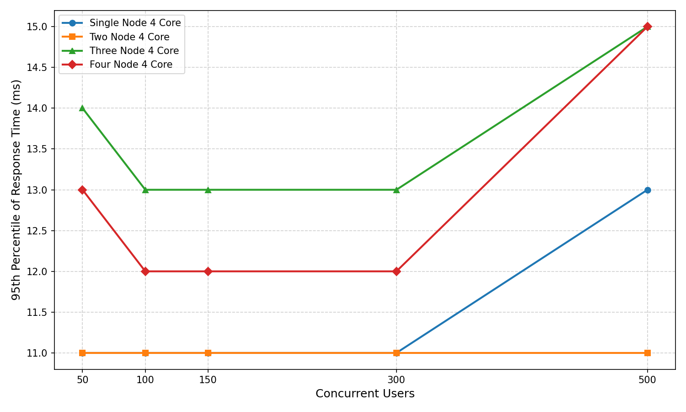

<ins>Concurrency: 50 – 3000</ins>

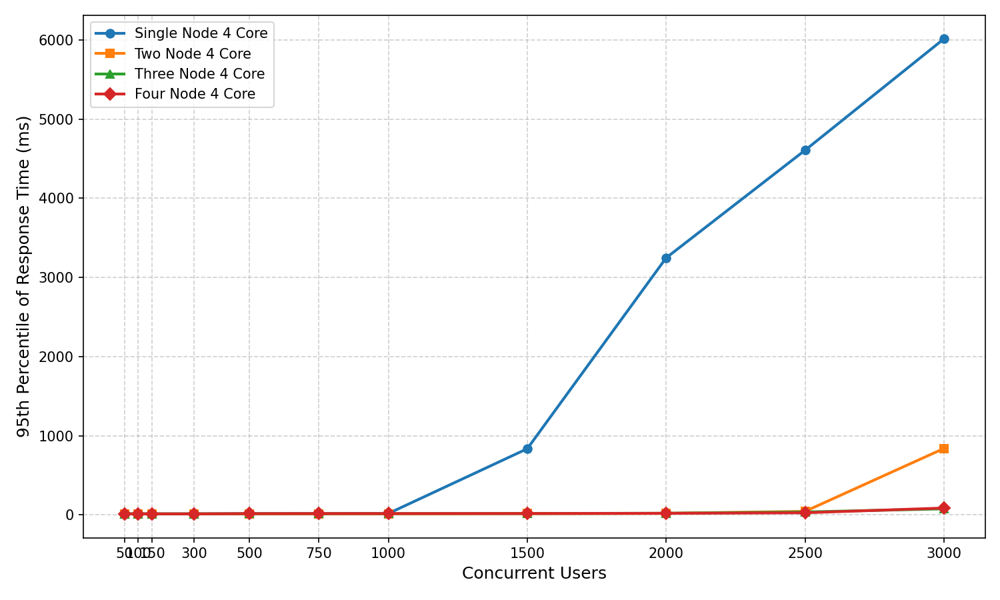

**Throughput**

<ins>Concurrency: 50 – 500</ins>

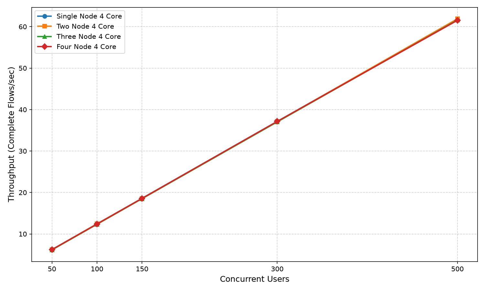

<ins>Concurrency: 50 – 3000</ins>

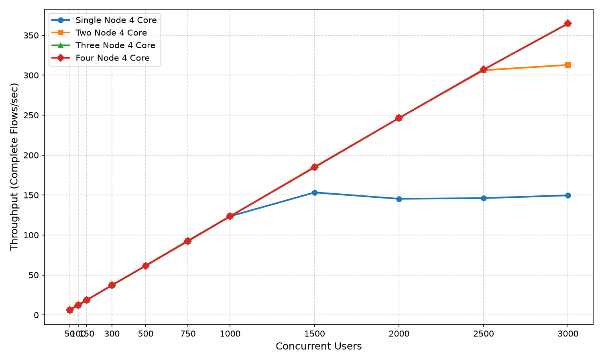

---

### 2. OIDC Auth Code Grant Redirect Without Consent

#### Obtain an access token and an id token using the OAuth 2.0 authorization code grant type without consent.

This scenario involves **4 sequential HTTP request steps**. The consent step is omitted as the OAuth application is pre-approved.

| Step | Description |
|---|---|
| 1. Authorize Endpoint Request | Initiates the authorization flow. |
| **2. Credential Submission** ✦ | The user submits their username and password. This is the primary bottleneck step under load. |
| 3. Authorization Callback | The server validates credentials and issues an authorization code directly (no consent required). |
| 4. Token Request | Exchanges the authorization code for an access token and ID token. |

> A random think-time delay is applied before credential submission. Throughput represents **complete 4-step flows per second**.

**Performance Comparison with 95th Percentile of Response Time (ms) — Credential Submission Step ✦**

Concurrent Users | Single Node 4 Core | Two Node 4 Core | Three Node 4 Core | Four Node 4 Core
---|---|---|---|---
50 | 33 | 33 | 38 | 37
100 | 33 | 33 | 38 | 36
150 | 27 | 26 | 32 | 30
300 | 28 | 26 | 32 | 29
500 | 35 | 31 | 42 | 42
750 | 38 | 28 | 38 | 39
1000 | 80 | 30 | 39 | 39
1500 | 2463 | 42 | 43 | 43
2000 | 4735 | 99 | 58 | 54
2500 | 7391 | 1975 | 281 | 271
3000 | 10239 | 4191 | 1095 | 1191

**Throughput Comparison (Complete Flows/sec) — Credential Submission Step ✦**

Concurrent Users | Single Node 4 Core | Two Node 4 Core | Three Node 4 Core | Four Node 4 Core
---|---|---|---|---
50 | 8.27 | 8.26 | 8.17 | 8.20
100 | 16.44 | 16.48 | 16.40 | 16.46
150 | 24.68 | 24.63 | 24.65 | 24.75
300 | 49.50 | 49.52 | 49.43 | 49.52
500 | 82.38 | 82.57 | 82.15 | 82.20
750 | 123.62 | 123.44 | 123.25 | 123.10
1000 | 163.82 | 165.18 | 164.23 | 164.11
1500 | 150.97 | 246.72 | 246.20 | 246.16
2000 | 141.15 | 325.14 | 327.18 | 326.79
2500 | 151.32 | 308.32 | 397.50 | 399.42
3000 | 149.32 | 298.02 | 420.06 | 420.89

**95th Percentile of Response Time**

<ins>Concurrency: 50 – 500</ins>

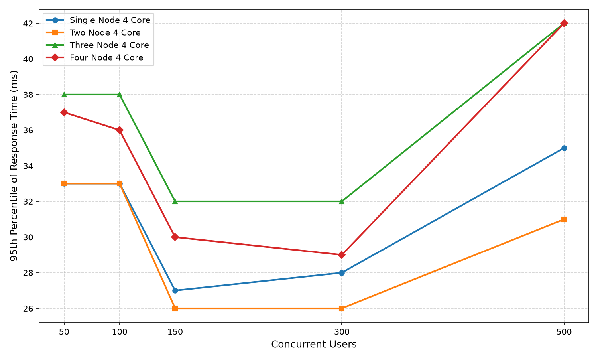

<ins>Concurrency: 50 – 3000</ins>

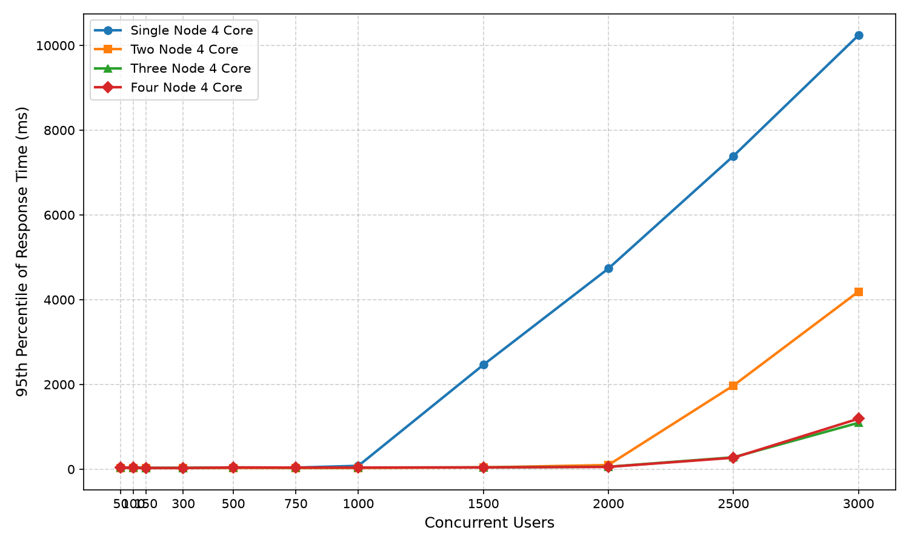

**Throughput**

<ins>Concurrency: 50 – 500</ins>

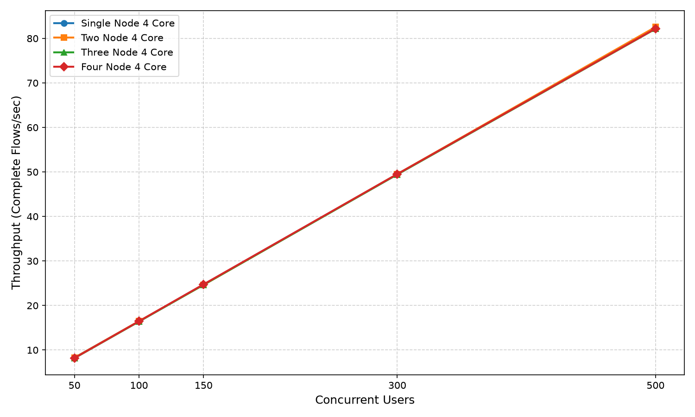

<ins>Concurrency: 50 – 3000</ins>

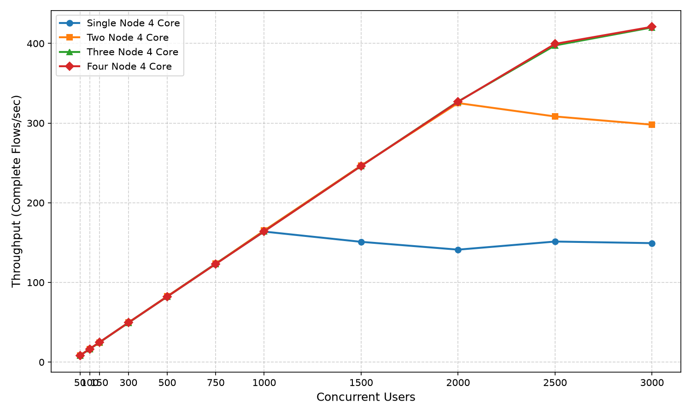

---

### 3. OIDC Auth Code Grant Redirect Without Consent Retrieving User Attributes

#### Obtain an access token and an id token without consent, while retrieving country, email, first name, and last name as user attributes.

This scenario follows the same **4 sequential HTTP request steps** as Scenario 2, with additional user attribute retrieval during token issuance.

| Step | Description |
|---|---|
| 1. Authorize Endpoint Request | Initiates the authorization flow. |
| **2. Credential Submission** ✦ | The user submits their username and password. This is the primary bottleneck step under load. |
| 3. Authorization Callback | Validates credentials, fetches user attributes (country, email, first name, last name), and issues an authorization code. |
| 4. Token Request | Issues access and ID tokens with embedded user attributes. |

> A random think-time delay is applied before credential submission. Throughput represents **complete 4-step flows per second**.

**Performance Comparison with 95th Percentile of Response Time (ms) — Credential Submission Step ✦**

Concurrent Users | Single Node 4 Core | Two Node 4 Core | Three Node 4 Core | Four Node 4 Core
---|---|---|---|---
50 | 28 | 28 | 34 | 33
100 | 27 | 26 | 33 | 30
150 | 27 | 26 | 32 | 30
300 | 28 | 26 | 32 | 29
500 | 30 | 26 | 37 | 39
750 | 38 | 28 | 38 | 38
1000 | 79 | 31 | 37 | 39
1500 | 2127 | 43 | 42 | 43
2000 | 4607 | 114 | 52 | 49
2500 | 7615 | 2191 | 287 | 305
3000 | 10367 | 4159 | 1079 | 1247

**Throughput Comparison (Complete Flows/sec) — Credential Submission Step ✦**

Concurrent Users | Single Node 4 Core | Two Node 4 Core | Three Node 4 Core | Four Node 4 Core
---|---|---|---|---
50 | 8.23 | 8.26 | 8.20 | 8.23
100 | 16.47 | 16.41 | 16.40 | 16.51
150 | 24.68 | 24.60 | 24.70 | 24.86
300 | 49.41 | 49.55 | 49.59 | 49.30
500 | 82.29 | 82.28 | 82.16 | 81.98
750 | 123.46 | 123.78 | 123.28 | 123.31
1000 | 163.25 | 164.99 | 164.27 | 164.24
1500 | 157.14 | 246.46 | 246.04 | 246.37
2000 | 141.67 | 325.19 | 327.78 | 327.58
2500 | 150.75 | 300.50 | 399.73 | 399.69
3000 | 147.08 | 299.71 | 420.67 | 417.70

**95th Percentile of Response Time**

<ins>Concurrency: 50 – 500</ins>

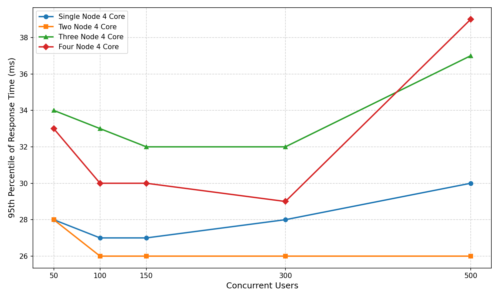

<ins>Concurrency: 50 – 3000</ins>

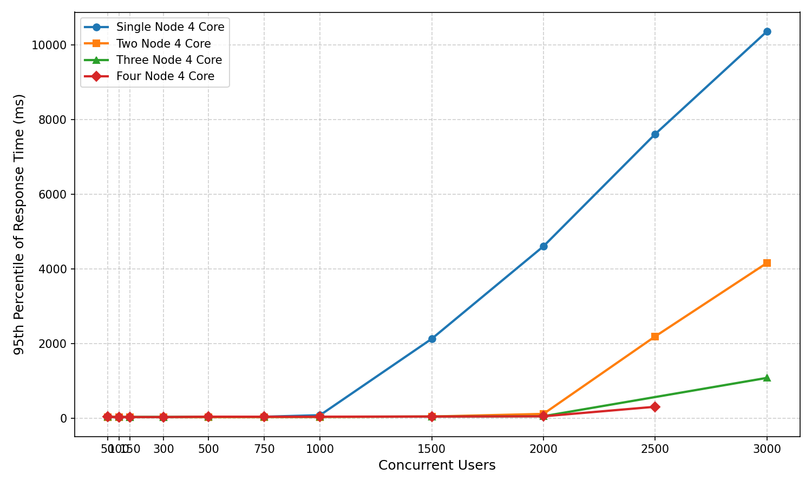

**Throughput**

<ins>Concurrency: 50 – 500</ins>

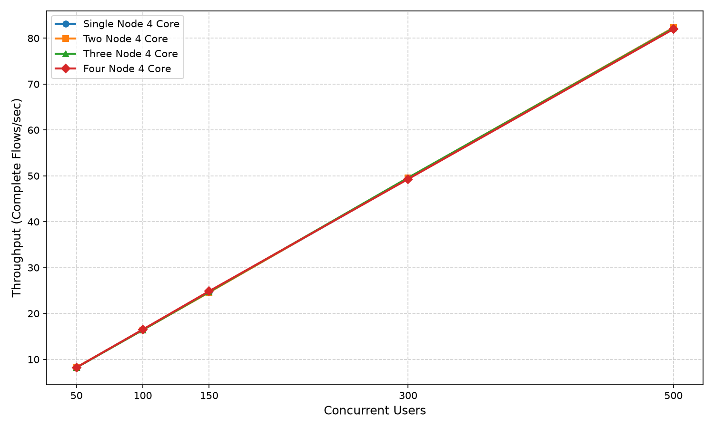

<ins>Concurrency: 50 – 3000</ins>

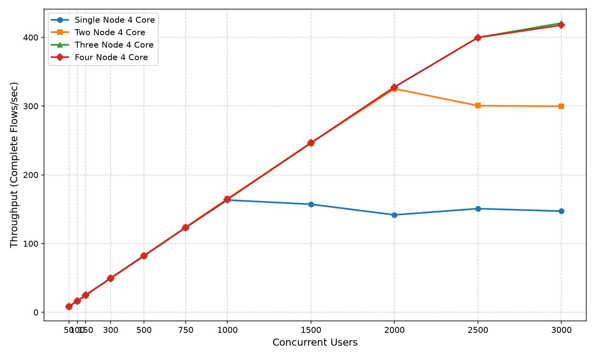

---

### 4. OIDC Auth Code Grant Redirect Without Consent Retrieving User Attributes, Groups and Roles

#### Obtain an access token and an id token without consent, retrieving user attributes along with group memberships and role assignments.

This scenario extends Scenario 3 with the same **4 sequential HTTP request steps**, adding group and role data retrieval.

| Step | Description |
|---|---|
| 1. Authorize Endpoint Request | Initiates the authorization flow. |
| **2. Credential Submission** ✦ | The user submits their username and password. This is the primary bottleneck step under load. |
| 3. Authorization Callback | Validates credentials, fetches user attributes (country, email, first name, last name), group memberships, and role assignments. |
| 4. Token Request | Issues access and ID tokens with embedded user attributes, groups, and roles. |

> A random think-time delay is applied before credential submission. Throughput represents **complete 4-step flows per second**.

**Performance Comparison with 95th Percentile of Response Time (ms) — Credential Submission Step ✦**

Concurrent Users | Single Node 4 Core | Two Node 4 Core | Three Node 4 Core | Four Node 4 Core
---|---|---|---|---
50 | 28 | 27 | 34 | 33
100 | 28 | 27 | 33 | 32
150 | 27 | 26 | 32 | 30
300 | 28 | 26 | 32 | 29
500 | 29 | 27 | 35 | 38
750 | 39 | 28 | 36 | 39
1000 | 78 | 31 | 37 | 39
1500 | 2559 | 42 | 42 | 42
2000 | 4863 | 77 | 59 | 50
2500 | 7807 | 1751 | 297 | 307
3000 | 11007 | 3839 | 1047 | 1159

**Throughput Comparison (Complete Flows/sec) — Credential Submission Step ✦**

Concurrent Users | Single Node 4 Core | Two Node 4 Core | Three Node 4 Core | Four Node 4 Core
---|---|---|---|---
50 | 8.27 | 8.23 | 8.26 | 8.19
100 | 16.46 | 16.52 | 16.46 | 16.51
150 | 24.79 | 24.76 | 24.68 | 24.72
300 | 49.57 | 49.53 | 49.45 | 49.48
500 | 82.40 | 82.45 | 82.13 | 82.07
750 | 123.37 | 123.67 | 123.08 | 123.22
1000 | 163.21 | 164.78 | 164.21 | 164.06
1500 | 139.08 | 246.79 | 246.07 | 246.26
2000 | 146.57 | 327.38 | 327.35 | 327.58
2500 | 141.69 | 320.09 | 397 | 398.59
3000 | 137.44 | 304.47 | 414.17 | 415.80

**95th Percentile of Response Time**

<ins>Concurrency: 50 – 500</ins>

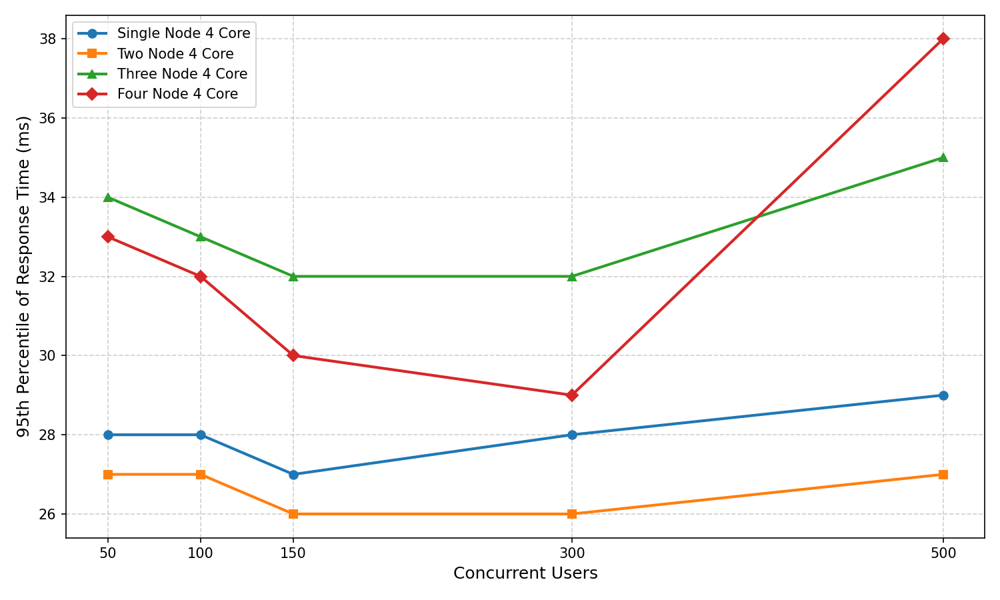

<ins>Concurrency: 50 – 3000</ins>

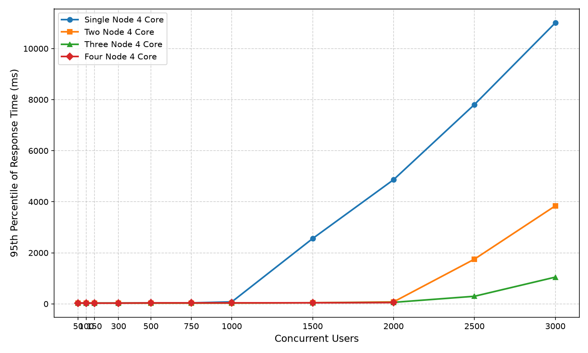

**Throughput**

<ins>Concurrency: 50 – 500</ins>

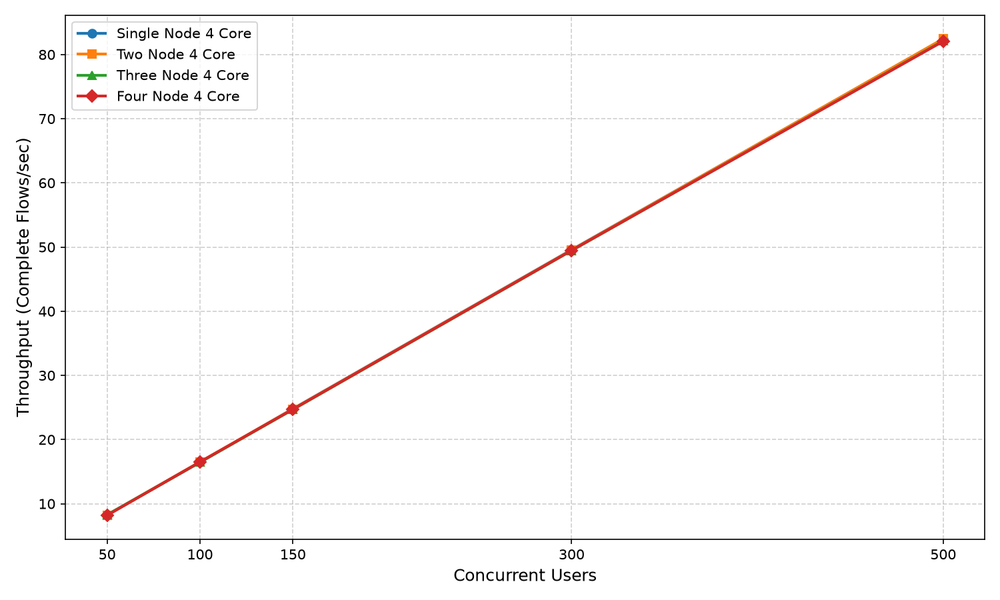

<ins>Concurrency: 50 – 3000</ins>

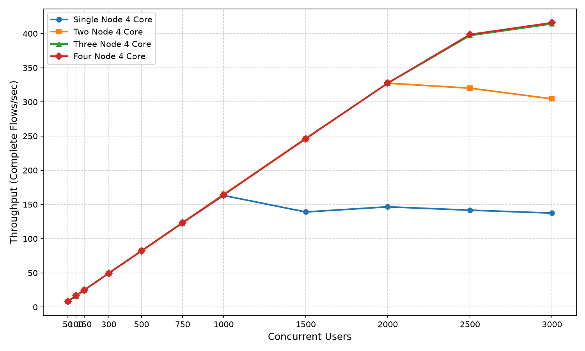

---

### 5. SAML2 SSO Redirect Binding

#### Obtain a SAML 2 assertion response using redirect binding.

This scenario involves **2 sequential HTTP request steps** that make up a complete SAML 2.0 SSO flow:

| Step | Description |
|---|---|
| 1. Initial SAML Request | The service provider sends a SAML authentication request to the identity provider via HTTP redirect binding. |
| **2. Identity Provider Login** ✦ | The user submits their credentials to the identity provider, which validates them, generates a signed SAML assertion, and redirects back to the service provider. This is the primary bottleneck step. |

> A random think-time delay is applied before credential submission. Throughput represents **complete 2-step SAML flows per second**.

**Performance Comparison with 95th Percentile of Response Time (ms) — Identity Provider Login Step ✦**

Concurrent Users | Single Node 4 Core | Two Node 4 Core | Three Node 4 Core | Four Node 4 Core
---|---|---|---|---
50 | 32 | 32 | 41 | 37
100 | 31 | 32 | 39 | 34
150 | 31 | 31 | 39 | 34
300 | 31 | 31 | 38 | 33
500 | 32 | 31 | 48 | 47
750 | 35 | 31 | 48 | 47
1000 | 41 | 33 | 49 | 47
1500 | 1463 | 38 | 51 | 50
2000 | 4047 | 46 | 56 | 55
2500 | 5599 | 73 | 65 | 58
3000 | 8575 | 439 | 351 | 353

**Throughput Comparison (Complete Flows/sec) — Identity Provider Login Step ✦**

Concurrent Users | Single Node 4 Core | Two Node 4 Core | Three Node 4 Core | Four Node 4 Core
---|---|---|---|---
50 | 8.21 | 8.31 | 8.31 | 8.25
100 | 16.46 | 16.55 | 16.47 | 16.56
150 | 24.87 | 24.86 | 24.77 | 24.79
300 | 49.58 | 49.79 | 49.77 | 49.54
500 | 82.31 | 82.27 | 82.43 | 82.22
750 | 123.98 | 123.55 | 123.43 | 123.49
1000 | 164.90 | 164.84 | 164.40 | 164.37
1500 | 228.96 | 247.16 | 246.03 | 246.14
2000 | 214.06 | 328.42 | 327.70 | 327.60
2500 | 234.48 | 408.70 | 408.20 | 408.25
3000 | 229.55 | 479.83 | 481.34 | 481.87

**95th Percentile of Response Time**

<ins>Concurrency: 50 – 500</ins>

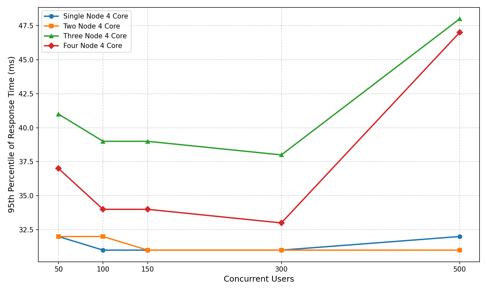

<ins>Concurrency: 50 – 3000</ins>

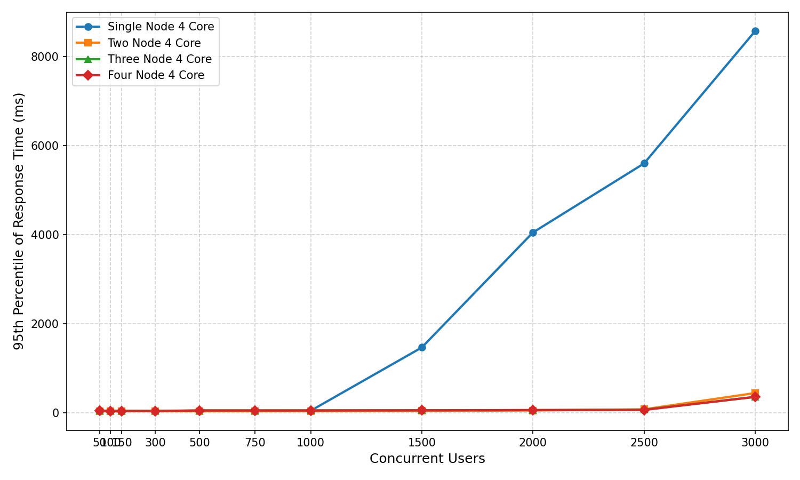

**Throughput**

<ins>Concurrency: 50 – 500</ins>

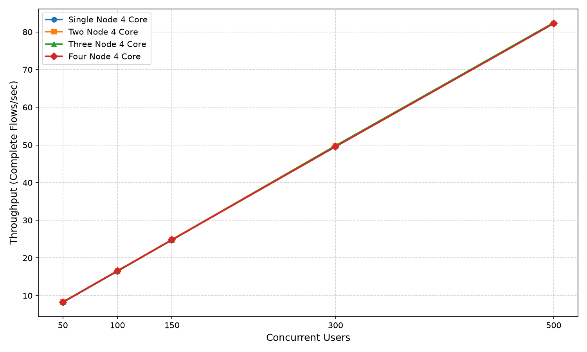

<ins>Concurrency: 50 – 3000</ins>

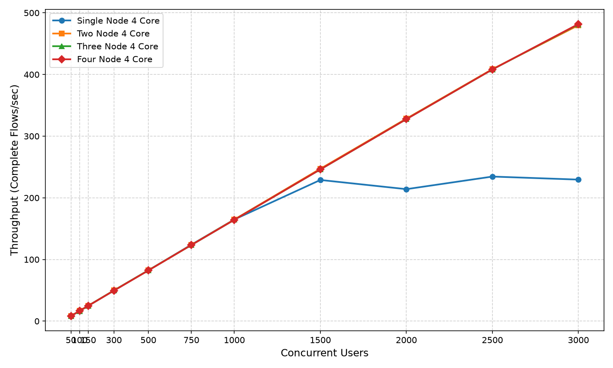

---

### 6. App Native Authentication

#### Obtain an access token and an id token using the app native authentication flow.

This scenario involves **3 sequential HTTP request steps**. Unlike browser-based redirect flows, App Native Authentication allows the application to handle the credential exchange directly without browser redirects:

| Step | Description |
|---|---|
| 1. Authorization Request | The application sends an authentication initiation request directly to the authorization endpoint. |
| **2. Credential Submission** ✦ | The user's credentials are submitted directly by the application. The identity provider validates them and returns an authentication result. This is the primary bottleneck step under load. |
| 3. Token Request | The application exchanges the authentication result for an access token and ID token. |

> A random think-time delay is applied before credential submission. Throughput represents **complete 3-step flows per second**.

**Performance Comparison with 95th Percentile of Response Time (ms) — Credential Submission Step ✦**

Concurrent Users | Single Node 4 Core | Two Node 4 Core | Three Node 4 Core | Four Node 4 Core
---|---|---|---|---
50 | 38 | 38 | 46 | 44
100 | 37 | 37 | 45 | 42
150 | 37 | 37 | 44 | 41
300 | 38 | 36 | 44 | 40
500 | 41 | 36 | 53 | 47
750 | 56 | 38 | 54 | 49
1000 | 1175 | 43 | 55 | 50
1500 | 3791 | 71 | 62 | 53
2000 | 6719 | 715 | 80 | 63
2500 | 10623 | 3263 | 423 | 391
3000 | 14207 | 5951 | 1535 | 1839

**Throughput Comparison (Complete Flows/sec) — Credential Submission Step ✦**

Concurrent Users | Single Node 4 Core | Two Node 4 Core | Three Node 4 Core | Four Node 4 Core
---|---|---|---|---
50 | 8.28 | 8.30 | 8.21 | 8.29
100 | 16.48 | 16.54 | 16.39 | 16.45
150 | 24.70 | 24.66 | 24.73 | 24.61
300 | 49.51 | 49.47 | 49.41 | 49.40
500 | 82.43 | 82.40 | 82.05 | 82.29
750 | 123.35 | 123.43 | 123.25 | 123.44
1000 | 146.61 | 164.78 | 164.32 | 164.14
1500 | 141.12 | 246.54 | 246.01 | 246.65
2000 | 137.55 | 312.61 | 327.65 | 327.96
2500 | 137.04 | 293.32 | 398.66 | 399.11
3000 | 137.82 | 286.96 | 412.67 | 414.20

**95th Percentile of Response Time**

<ins>Concurrency: 50 – 500</ins>

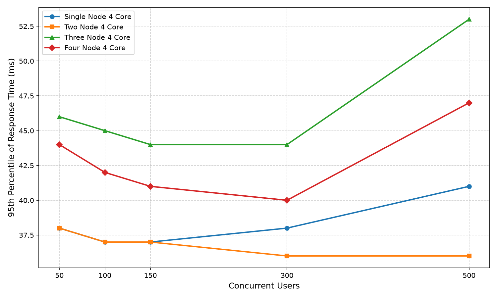

<ins>Concurrency: 50 – 3000</ins>

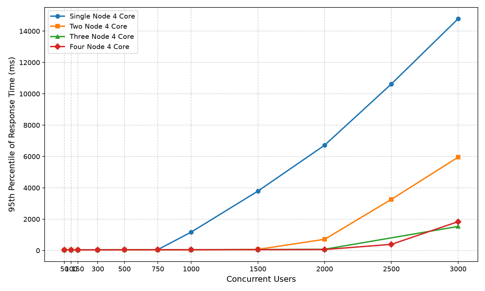

**Throughput**

<ins>Concurrency: 50 – 500</ins>

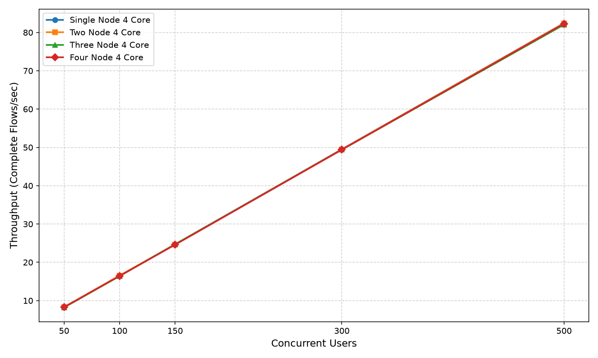

<ins>Concurrency: 50 – 3000</ins>

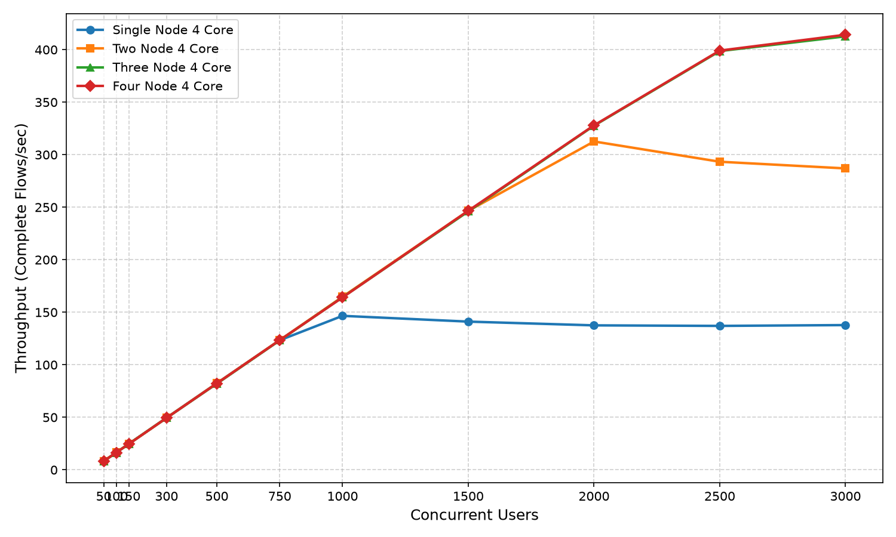

---

### 7. Token Exchange Grant Type

#### Obtain an access token and an id token using the OAuth 2.0 token exchange grant type.

This is a **single-step machine-to-machine flow**. A client presents an existing subject token and exchanges it for a new access token with a different audience or scope. There is no user interaction. The throughput and response time figures represent a single `/token` endpoint call.

**Performance Comparison with 95th Percentile of Response Time (ms)**

Concurrent Users | Single Node 4 Core | Two Node 4 Core | Three Node 4 Core | Four Node 4 Core
---|---|---|---|---
50 | 153 | 191 | 173 | 174
100 | 329 | 275 | 293 | 257
150 | 511 | 381 | 381 | 307
300 | 1063 | 811 | 699 | 489
500 | 1759 | 1615 | 1591 | 1423
750 | 2671 | 2399 | 2319 | 2007
1000 | 3471 | 3247 | 3151 | 2847
1500 | 4991 | 6047 | 4351 | 4255
2000 | 6175 | 7103 | 5887 | 4543
2500 | 7167 | 11839 | 4735 | 4255
3000 | 9023 | 16319 | 5919 | 4991

**Throughput Comparison (Requests/sec)**

Concurrent Users | Single Node 4 Core | Two Node 4 Core | Three Node 4 Core | Four Node 4 Core
---|---|---|---|---
50 | 492.38 | 714.29 | 825.92 | 853.73
100 | 475.99 | 768.87 | 911.09 | 897.57
150 | 468.43 | 819.55 | 961.73 | 1019.76
300 | 454.03 | 846.67 | 1059.51 | 1171.01
500 | 454.53 | 888.77 | 1090.21 | 1479.01
750 | 447.55 | 871.43 | 1106.33 | 1462.40
1000 | 440.20 | 882.40 | 1071.91 | 1459.30
1500 | 421.77 | 862.57 | 1077.10 | 1357.01
2000 | 437.69 | 805.03 | 1559.49 | 1954.81
2500 | 442.26 | 871.33 | 1650.79 | 1855.25
3000 | 427.69 | 845.24 | 1552.65 | 1818.84

> **Scaling insight**: Higher node counts scale throughput strongly for the Token Exchange grant. A Four Node cluster reaches roughly **1,955 req/s at 2000 concurrent users**, well above the Two Node result, while also holding lower 95th percentile response times at mid-to-high concurrency.

**95th Percentile of Response Time**

<ins>Concurrency: 50 – 500</ins>

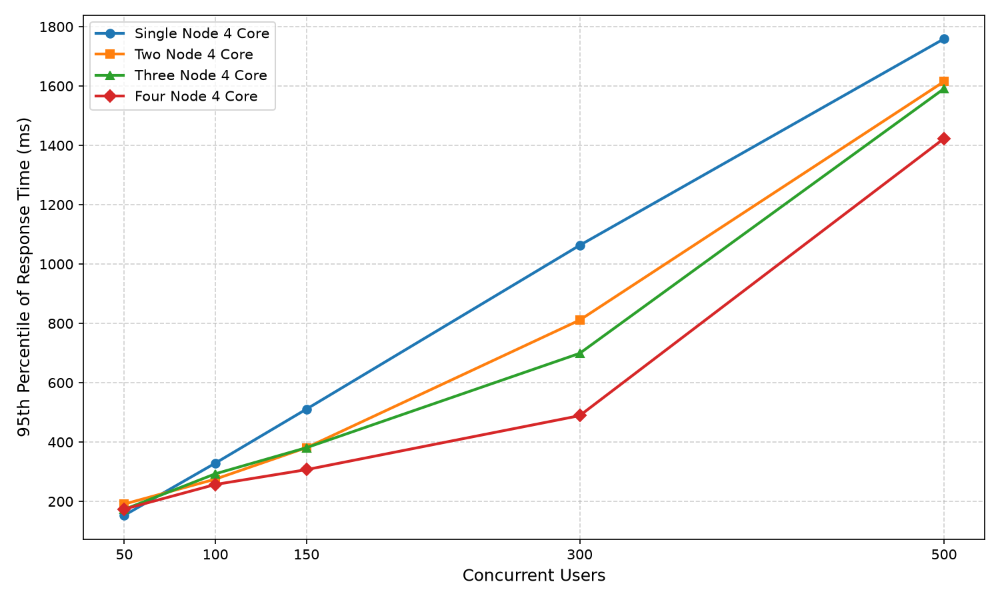

<ins>Concurrency: 50 – 3000</ins>

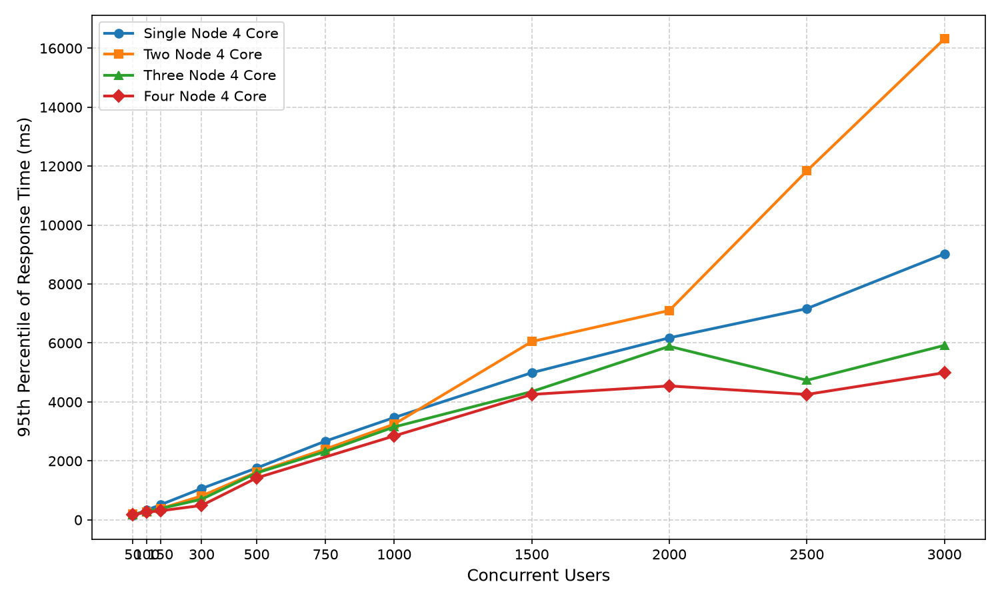

**Throughput**

<ins>Concurrency: 50 – 500</ins>

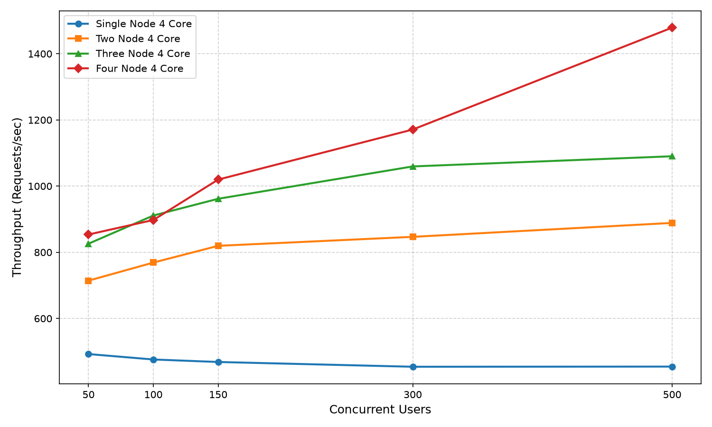

<ins>Concurrency: 50 – 3000</ins>

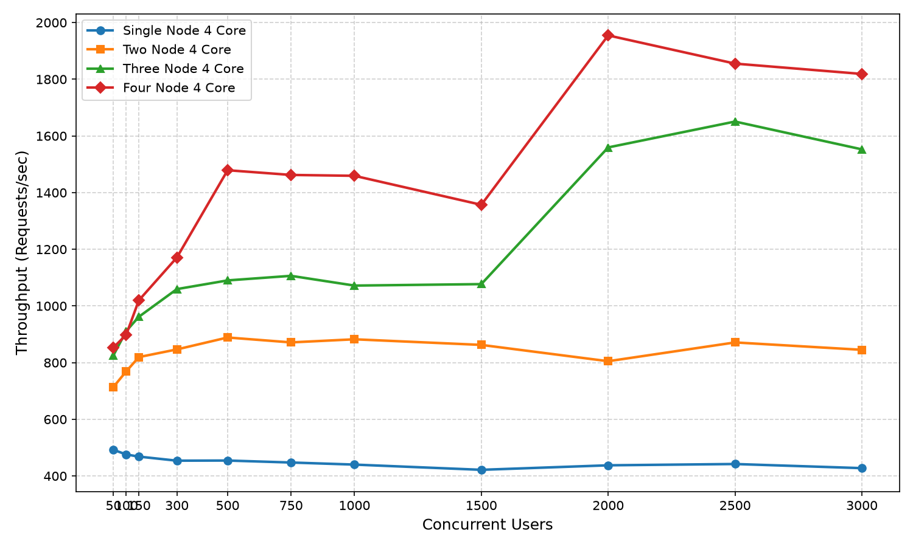

---

### 8. Client Credentials Grant Type

#### Obtain an access token using the OAuth 2.0 client credentials grant type.

This is a **single-step machine-to-machine flow**. A client application authenticates directly using its client ID and secret at the `/token` endpoint, with no user involvement. This is the simplest and highest-throughput grant type, suitable for service-to-service communication.

**Performance Comparison with 95th Percentile of Response Time (ms)**

Concurrent Users | Single Node 4 Core | Two Node 4 Core | Three Node 4 Core | Four Node 4 Core
---|---|---|---|---
50 | 74 | 51 | 35 | 25
100 | 138 | 194 | 118 | 50
150 | 203 | 373 | 243 | 126
300 | 429 | 819 | 575 | 287
500 | 783 | 1295 | 951 | 385
750 | 1399 | 2143 | 1679 | 1311
1000 | 1503 | 2223 | 1983 | 851
1500 | 2191 | 3071 | 2735 | 1511
2000 | 3007 | 4159 | 2367 | 2159
2500 | 4063 | 4831 | 2191 | 1807
3000 | 4895 | 5599 | 2175 | 1447

**Throughput Comparison (Requests/sec)**

Concurrent Users | Single Node 4 Core | Two Node 4 Core | Three Node 4 Core | Four Node 4 Core
---|---|---|---|---
50 | 1084.13 | 1750.07 | 2538.89 | 2856.20
100 | 1056.18 | 1744.60 | 2627.19 | 2927.64
150 | 1023.38 | 1896.92 | 2398.75 | 2949.31
300 | 990.67 | 1739.69 | 2638.63 | 2981.62
500 | 970.82 | 1868.69 | 2553.60 | 3014.67
750 | 836.79 | 1670.84 | 2491.09 | 3133.25
1000 | 1009.93 | 1849.52 | 2579.61 | 2898.68
1500 | 993.18 | 1827.82 | 2635.45 | 2907.15
2000 | 971.99 | 1797.86 | 2964.64 | 3454.13
2500 | 939.48 | 1795.96 | 2919.44 | 3390.89
3000 | 818.55 | 1775.21 | 2886.31 | 3338.06

> **Scaling insight**: Client Credentials shows near-linear throughput scaling with node count. A Four Node cluster sustains over **3,400 req/s** at 2000 concurrent users compared to ~1,800 req/s for Two Node — demonstrating strong horizontal scalability for this grant type.

**95th Percentile of Response Time**

<ins>Concurrency: 50 – 500</ins>

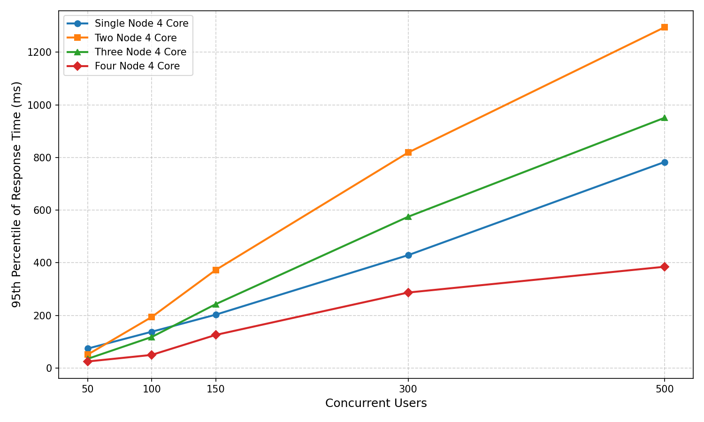

<ins>Concurrency: 50 – 3000</ins>

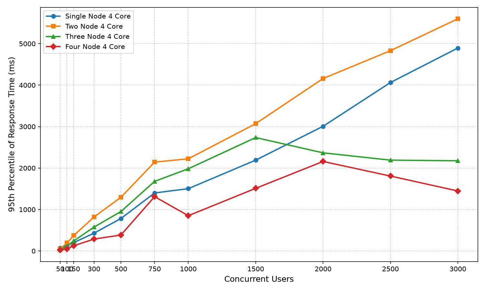

**Throughput**

<ins>Concurrency: 50 – 500</ins>

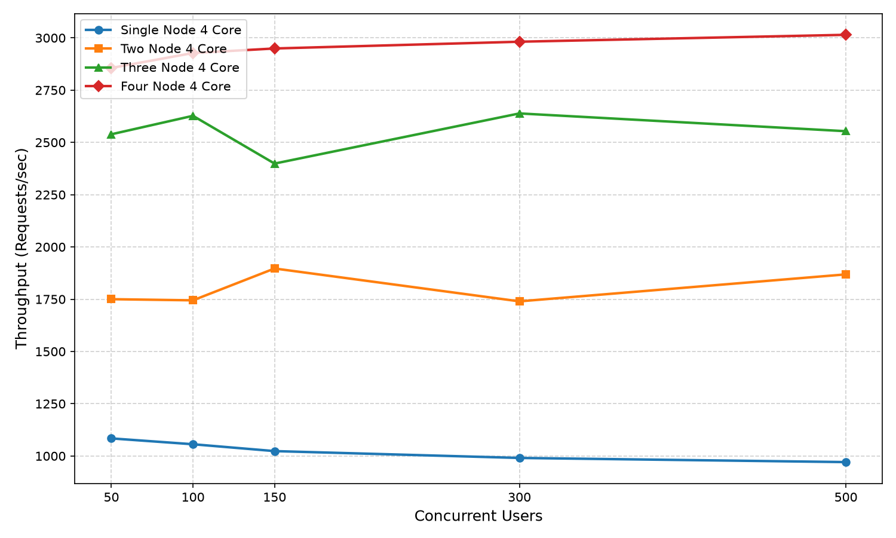

<ins>Concurrency: 50 – 3000</ins>

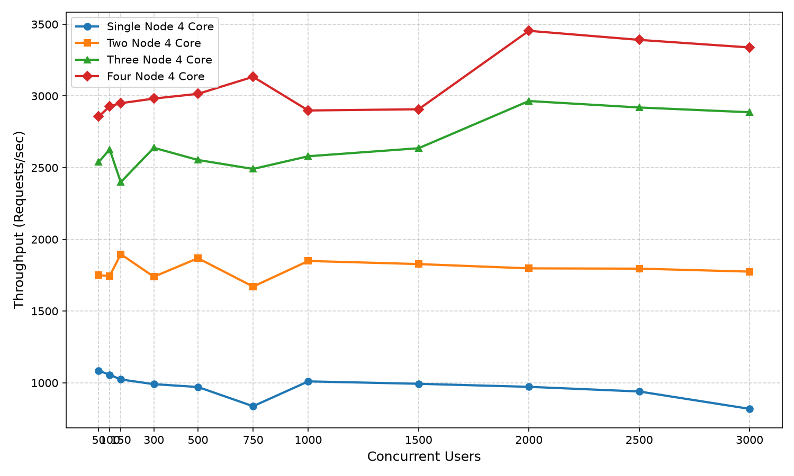

---

### 9. OIDC Password Grant Type

#### Obtain an access token and an id token using the OAuth 2.0 password grant type.

This is a **single-step flow** where the user's credentials are passed directly to the `/token` endpoint by the client application. This grant type places more processing load on the identity provider as it must validate credentials and issue tokens in a single request.

**Performance Comparison with 95th Percentile of Response Time (ms)**

Concurrent Users | Single Node 4 Core | Two Node 4 Core | Three Node 4 Core | Four Node 4 Core
---|---|---|---|---
50 | 157 | 177 | 182 | 183
100 | 289 | 291 | 236 | 233
150 | 455 | 421 | 297 | 303
300 | 955 | 879 | 543 | 419
500 | 1559 | 1479 | 1423 | 1351
750 | 2463 | 2383 | 2287 | 2111
1000 | 3103 | 3471 | 3279 | 3375
1500 | 4415 | 7391 | 5919 | 5343
2000 | 5695 | 9471 | 4863 | 6527
2500 | 7231 | 8255 | 7039 | 5279
3000 | 8383 | 18303 | 6975 | 6143

**Throughput Comparison (Requests/sec)**

Concurrent Users | Single Node 4 Core | Two Node 4 Core | Three Node 4 Core | Four Node 4 Core
---|---|---|---|---
50 | 457.94 | 708.97 | 858.93 | 934.63
100 | 430.68 | 752.24 | 953.06 | 1043.80
150 | 400.10 | 778.25 | 1002.80 | 1089.76
300 | 388.98 | 772.03 | 1099.88 | 1232.87
500 | 401.99 | 793.72 | 1166.76 | 1551.69
750 | 388.34 | 777.74 | 1163.33 | 1538.17
1000 | 396.16 | 762.26 | 1131.35 | 1342.39
1500 | 394.49 | 691.45 | 1139.62 | 1501.48
2000 | 392.23 | 762.22 | 1774.08 | 2093.38
2500 | 380.97 | 747.34 | 1710.47 | 1916.33
3000 | 386.57 | 672.99 | 1744.98 | 1893.84

> **Scaling insight**: The Password Grant places heavier load on the server than machine-to-machine grants. Three and Four Node configurations substantially improve throughput — reaching ~2,093 req/s at 2000 concurrent users with a Four Node cluster — and maintain consistently lower response times at mid-to-high concurrency.

**95th Percentile of Response Time**

<ins>Concurrency: 50 – 500</ins>

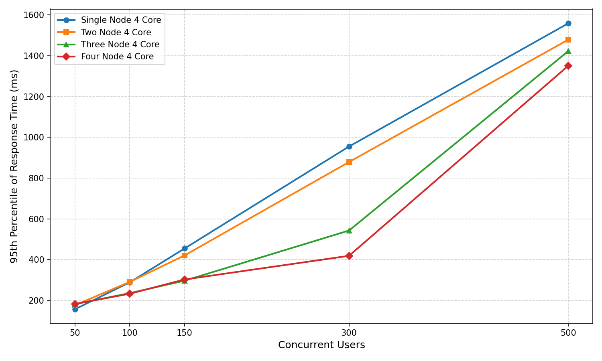

<ins>Concurrency: 50 – 3000</ins>

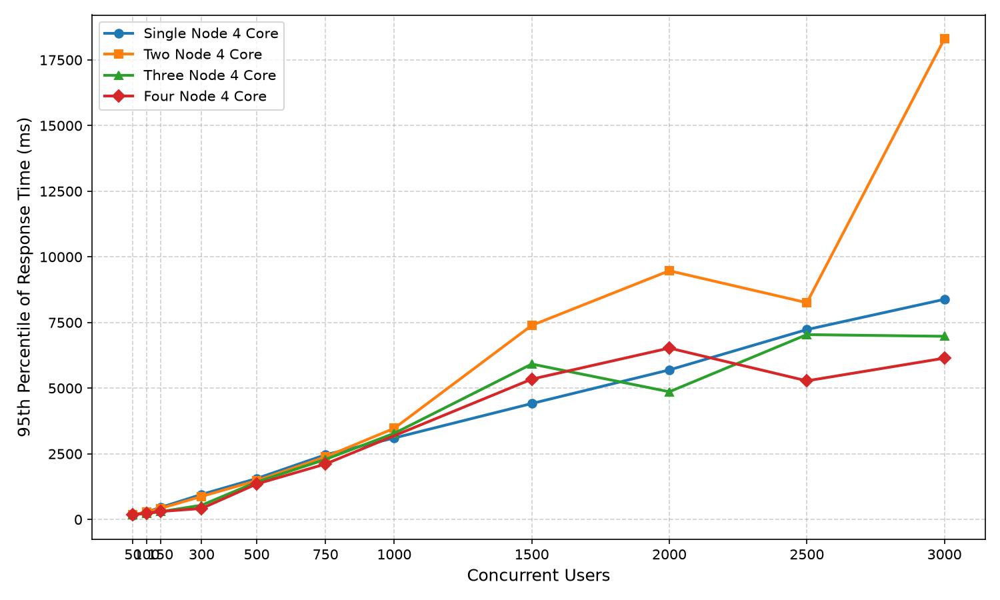

**Throughput**

<ins>Concurrency: 50 – 500</ins>

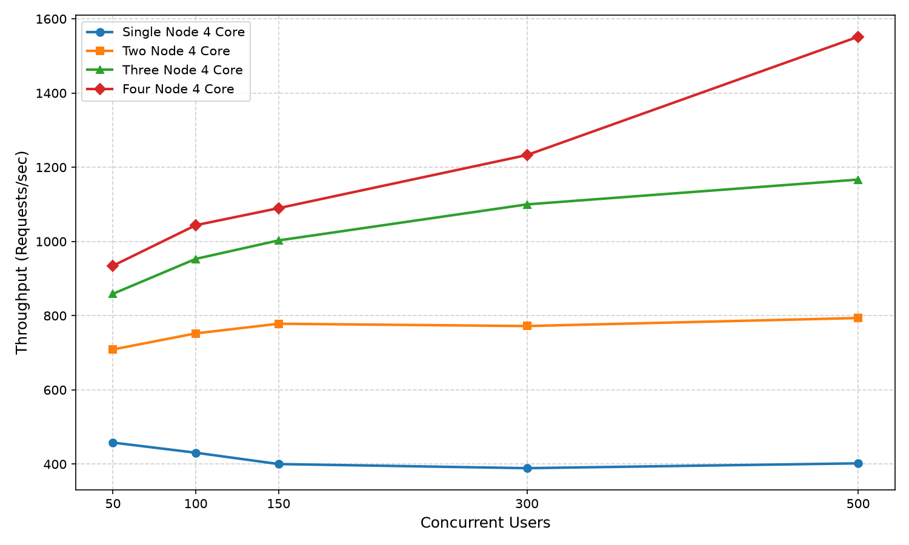

<ins>Concurrency: 50 – 3000</ins>

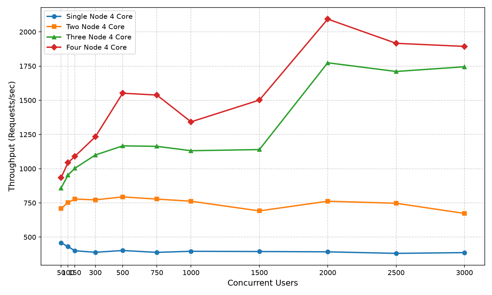

---
