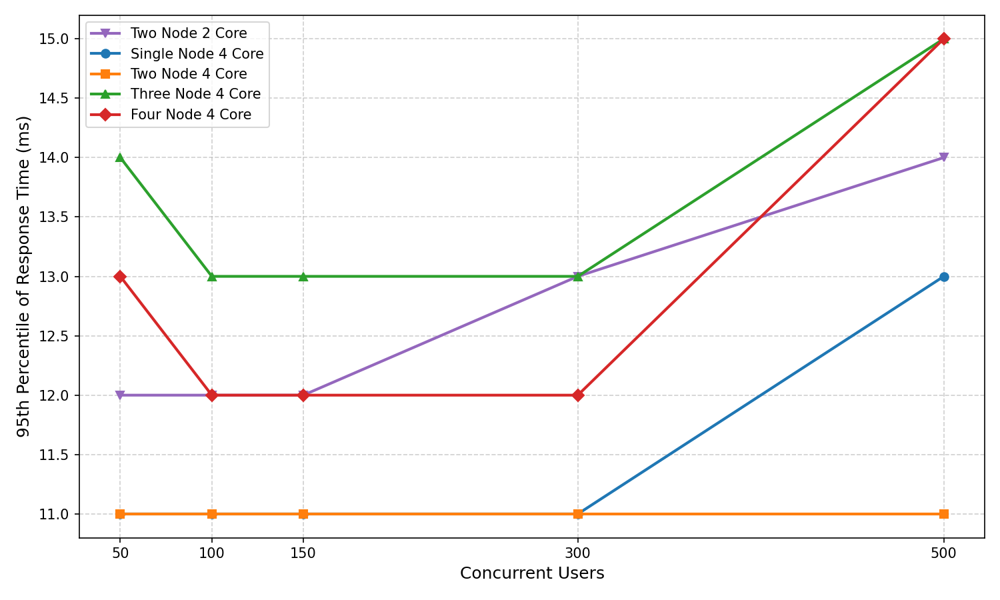
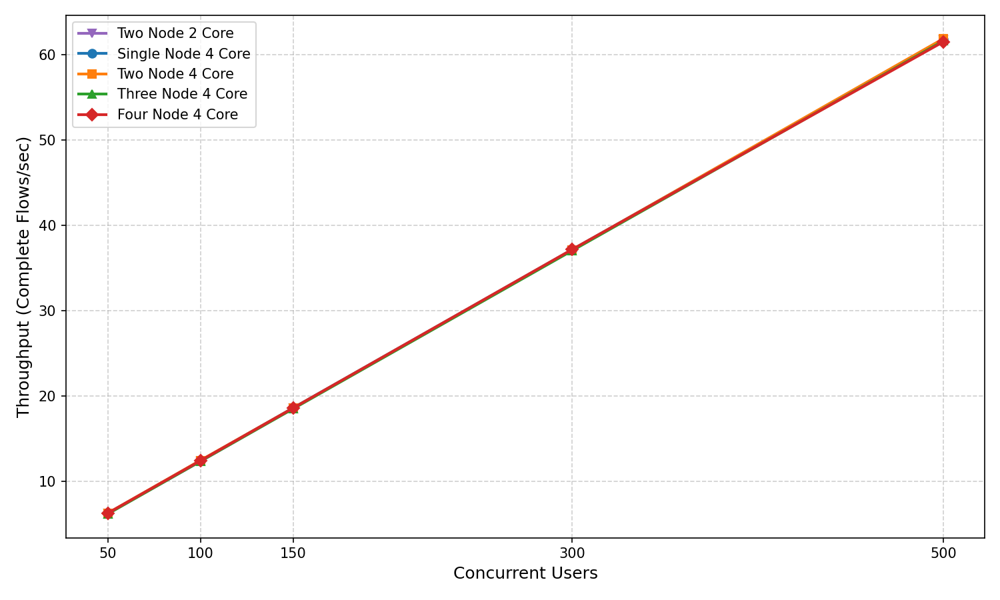
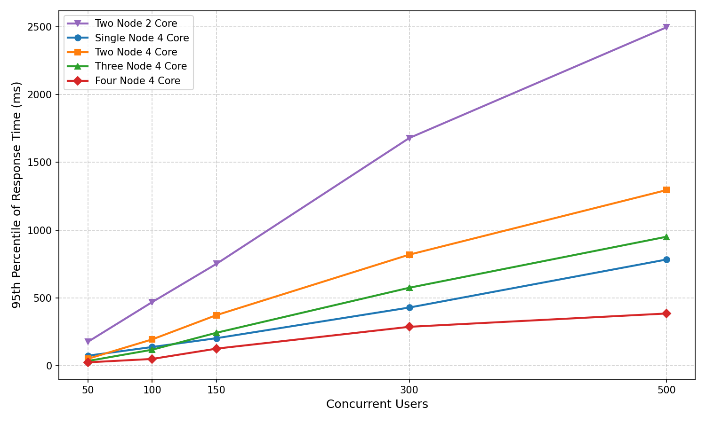
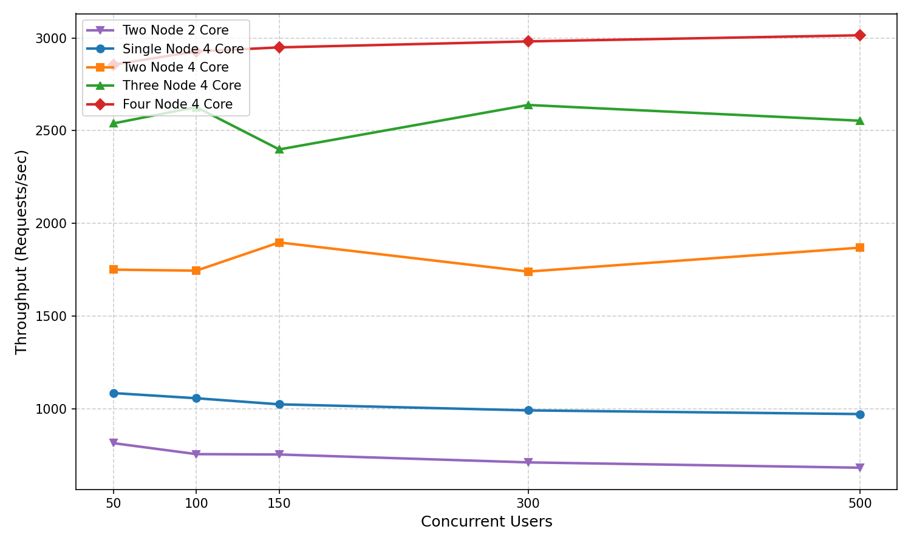
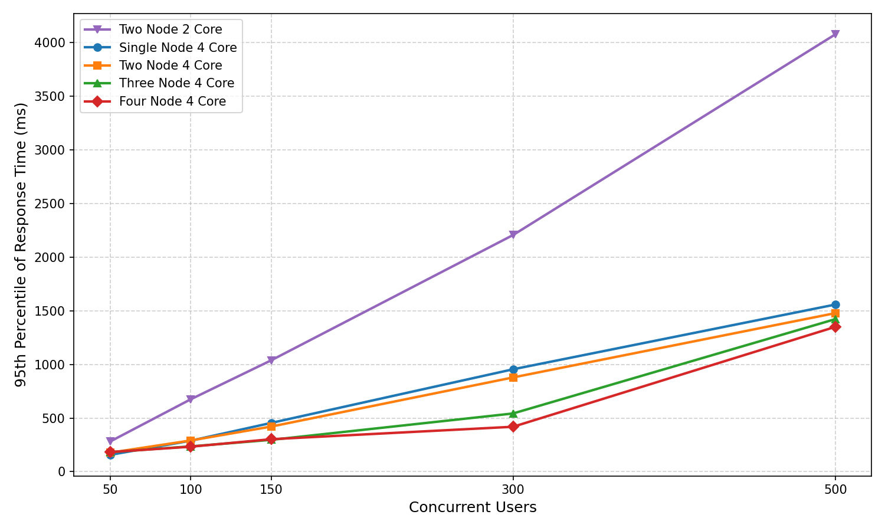
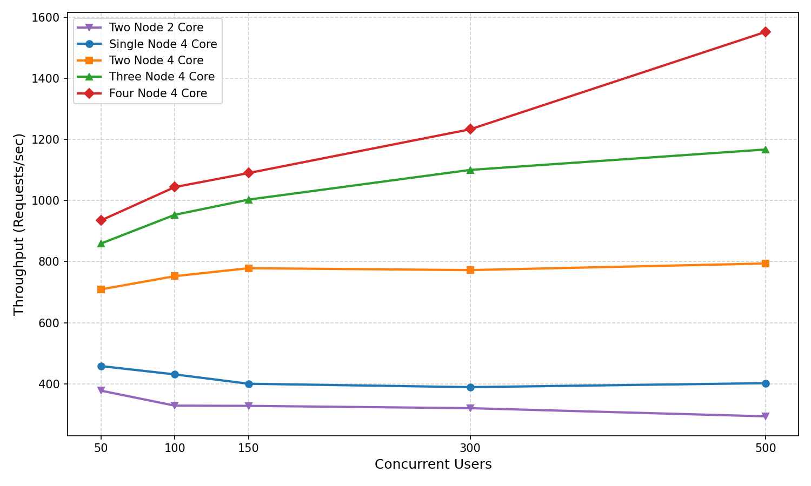

# IAM 7.3.0 Performance Test Results — Two Node 2 Core Comparison

This document compares a **two-node cluster of 2-core nodes (2N2C)** against the four 4-core
configurations published in [7.3_performance_summary.md](7.3_performance_summary.md) — Single Node
4 Core, Two Node 4 Core, Three Node 4 Core and Four Node 4 Core.

Two constraints shape this document:

- The comparison covers the **50 – 500 concurrency range only**, because that is the range the 2N2C
  run was executed over. The 4-core figures are the same published values, sliced to that range.
- It covers the **three scenarios** for which 2N2C results exist: OIDC Auth Code Grant Redirect With
  Consent, Client Credentials Grant Type, and OIDC Password Grant Type.

| Test Scenario | Description |
|---|---|
| OIDC Auth Code Grant Redirect With Consent | Obtain an access token and an id token using the OAuth 2.0 authorization code grant type. |
| Client Credentials Grant Type | Obtain an access token using the OAuth 2.0 client credentials grant type. |
| OIDC Password Grant Type | Obtain an access token and an id token using the OAuth 2.0 password grant type. |

## Data provenance

| Series | Source |
|---|---|
| Two Node 2 Core | `[Publish] IS 7.3.0 Performance Sheet - 2 core - 2N2C basic.csv` |
| Single / Two / Three / Four Node 4 Core | [7.3_performance_summary.md](7.3_performance_summary.md) |

> **Note:** the exported 2N2C sheet records only measurements — it carries no run metadata. The heap
> size and EC2 instance type used for that run are therefore **not confirmed** in this document and
> should be verified before publishing externally. The 4-core runs used `c6i.xlarge` with a 4 GB heap.

## Understanding the metrics

The conventions are those of the main summary. Throughput is the rate of the **primary bottleneck
step** marked **✦** — complete end-to-end flows per second for multi-step flows, requests per second
at the `/token` endpoint for single-step grants. Response times are **95th percentile values in
milliseconds** for that same step, so both metrics describe the same gating step.

| Test Parameter | Values |
|---|---|
| Concurrent Users | 50, 100, 150, 300, 500 |
| No of Users / OAuth Applications | 1000 / 1000 |
| Token Issuer | JWT |
| RDS Instance Type | [**db.m6i.2xlarge**](https://aws.amazon.com/rds/instance-types/) |
| IS Instance Type (4 Core configurations) | [**c6i.xlarge**](https://aws.amazon.com/ec2/instance-types/) |
| IS Instance Type (Two Node 2 Core) | 2 vCPU per node — exact type not recorded in the export |

---

## Performance Test Results

### 1. OIDC Auth Code Grant Redirect With Consent

#### Obtain an access token and an id token using the OAuth 2.0 authorization code grant type.

This scenario involves **5 sequential HTTP request steps** to complete the full authorization flow
with user consent:

| Step | Description |
|---|---|
| 1. Authorize Endpoint Request | Initiates the authorization flow by calling the `/authorize` endpoint. |
| 2. Credential Submission | The user submits their username and password to the identity provider. |
| 3. Authorization Callback | The server validates credentials and issues an intermediate authorization response. |
| **4. Consent Approval** ✦ | The user approves the requested OAuth scopes. This is the primary bottleneck step under load. |
| 5. Token Request | Exchanges the authorization code for an access token and ID token. |

> A random think-time delay is applied before credential submission and consent approval to simulate
> realistic user interaction. Throughput represents **complete 5-step flows per second**.

> **Step selection caveat:** step 4 is reported here for consistency with the published summary,
> where it is the step that collapses first at high concurrency. Within the 50 – 500 range measured
> for 2N2C it is *not* the slowest step — "Get tokens" (24 – 32 ms) and "Common Auth Login"
> (24 – 29 ms) are consistently higher than the 12 – 14 ms shown below.

**Performance Comparison with 95th Percentile of Response Time (ms) — Consent Approval Step ✦**

Concurrent Users | Two Node 2 Core | Single Node 4 Core | Two Node 4 Core | Three Node 4 Core | Four Node 4 Core
---|---|---|---|---|---
50 | 12 | 11 | 11 | 14 | 13
100 | 12 | 11 | 11 | 13 | 12
150 | 12 | 11 | 11 | 13 | 12
300 | 13 | 11 | 11 | 13 | 12
500 | 14 | 13 | 11 | 15 | 15

**Throughput Comparison (Complete Flows/sec) — Consent Approval Step ✦**

Concurrent Users | Two Node 2 Core | Single Node 4 Core | Two Node 4 Core | Three Node 4 Core | Four Node 4 Core
---|---|---|---|---|---
50 | 6.19 | 6.20 | 6.22 | 6.14 | 6.22
100 | 12.32 | 12.39 | 12.43 | 12.33 | 12.40
150 | 18.56 | 18.59 | 18.57 | 18.50 | 18.58
300 | 37.06 | 37.12 | 37.10 | 37.02 | 37.15
500 | 61.77 | 61.79 | 61.89 | 61.63 | 61.53

> **Reading the throughput chart:** all five series coincide. In this range the flow is bound by the
> client's think-time pacing rather than by server capacity, so throughput is a function of
> concurrency alone and is identical across every deployment — including the 2-core one. Response
> time is the only discriminator here, and even a 2N2C cluster tracks the 4-core configurations
> within 1 – 3 ms. Divergence between deployments on this scenario only appears above 1000
> concurrent users; see the main summary for that range.

**95th Percentile of Response Time**

<ins>Concurrency: 50 – 500</ins>



**Throughput**

<ins>Concurrency: 50 – 500</ins>



---

### 2. Client Credentials Grant Type

#### Obtain an access token using the OAuth 2.0 client credentials grant type.

This is a **single-step machine-to-machine flow**. A client application authenticates directly using
its client ID and secret at the `/token` endpoint, with no user involvement. Because there is no
think time, the load is server-bound throughout and the deployments separate immediately.

**Performance Comparison with 95th Percentile of Response Time (ms)**

Concurrent Users | Two Node 2 Core | Single Node 4 Core | Two Node 4 Core | Three Node 4 Core | Four Node 4 Core
---|---|---|---|---|---
50 | 176 | 74 | 51 | 35 | 25
100 | 469 | 138 | 194 | 118 | 50
150 | 751 | 203 | 373 | 243 | 126
300 | 1679 | 429 | 819 | 575 | 287
500 | 2495 | 783 | 1295 | 951 | 385

**Throughput Comparison (Requests/sec)**

Concurrent Users | Two Node 2 Core | Single Node 4 Core | Two Node 4 Core | Three Node 4 Core | Four Node 4 Core
---|---|---|---|---|---
50 | 813.94 | 1084.13 | 1750.07 | 2538.89 | 2856.20
100 | 754.67 | 1056.18 | 1744.60 | 2627.19 | 2927.64
150 | 752.65 | 1023.38 | 1896.92 | 2398.75 | 2949.31
300 | 710.08 | 990.67 | 1739.69 | 2638.63 | 2981.62
500 | 681.38 | 970.82 | 1868.69 | 2553.60 | 3014.67

> **Scaling insight**: 2N2C sustains **681 – 814 req/s**, i.e. 54 – 64% below Two Node 4 Core. That
> is a slightly worse than linear penalty for halving the cores per node — 2N2C delivers 36 – 47% of
> the 2N4C rate where proportional scaling would predict 50%. Throughput also **declines** as
> concurrency rises (814 req/s at 50 users down to 681 req/s at 500), indicating the 2-core nodes are
> already saturated at the bottom of this range.

**95th Percentile of Response Time**

<ins>Concurrency: 50 – 500</ins>



**Throughput**

<ins>Concurrency: 50 – 500</ins>



---

### 3. OIDC Password Grant Type

#### Obtain an access token and an id token using the OAuth 2.0 password grant type.

This is a **single-step flow** where the user's credentials are passed directly to the `/token`
endpoint by the client application. This grant type places more processing load on the identity
provider, as it must validate credentials and issue tokens in a single request.

**Performance Comparison with 95th Percentile of Response Time (ms)**

Concurrent Users | Two Node 2 Core | Single Node 4 Core | Two Node 4 Core | Three Node 4 Core | Four Node 4 Core
---|---|---|---|---|---
50 | 281 | 157 | 177 | 182 | 183
100 | 675 | 289 | 291 | 236 | 233
150 | 1039 | 455 | 421 | 297 | 303
300 | 2207 | 955 | 879 | 543 | 419
500 | 4079 | 1559 | 1479 | 1423 | 1351

**Throughput Comparison (Requests/sec)**

Concurrent Users | Two Node 2 Core | Single Node 4 Core | Two Node 4 Core | Three Node 4 Core | Four Node 4 Core
---|---|---|---|---|---
50 | 377.51 | 457.94 | 708.97 | 858.93 | 934.63
100 | 328.42 | 430.68 | 752.24 | 953.06 | 1043.80
150 | 327.70 | 400.10 | 778.25 | 1002.80 | 1089.76
300 | 320.14 | 388.98 | 772.03 | 1099.88 | 1232.87
500 | 293.44 | 401.99 | 793.72 | 1166.76 | 1551.69

> **Scaling insight**: 2N2C peaks at **377 req/s** and degrades to 293 req/s by 500 concurrent
> users, 47 – 63% below Two Node 4 Core. The 95th percentile reaches **4079 ms at 500 users** —
> 2.8× the Two Node 4 Core figure — so the password grant is the least forgiving of the three
> scenarios on 2-core nodes.

**95th Percentile of Response Time**

<ins>Concurrency: 50 – 500</ins>



**Throughput**

<ins>Concurrency: 50 – 500</ins>



---

## Scaling observations

**Scale-up beat scale-out at equal total core count.** Two Node 2 Core and Single Node 4 Core both
provide four vCPUs in total, but the single 4-core node was faster on both server-bound scenarios:

| Scenario | Metric at 500 users | Two Node 2 Core | Single Node 4 Core | Difference |
|---|---|---|---|---|
| Client Credentials | Throughput (req/s) | 681.38 | 970.82 | 2N2C 29.8% lower |
| Client Credentials | 95th percentile (ms) | 2495 | 783 | 2N2C 3.2× higher |
| OIDC Password Grant | Throughput (req/s) | 293.44 | 401.99 | 2N2C 27.0% lower |
| OIDC Password Grant | 95th percentile (ms) | 4079 | 1559 | 2N2C 2.6× higher |

Across the whole 50 – 500 range 2N2C returned 18 – 30% less throughput than 1N4C at matched core
count, so splitting four cores across two nodes cost throughput rather than adding it. Clustering
overhead and per-node capacity limits are the likely causes; this is a single pair of runs, not a
controlled scale-up-versus-scale-out study, so treat the direction as indicative.

**Two cores per node saturate early.** On both server-bound scenarios 2N2C throughput peaks at the
lowest measured concurrency (50 users) and falls from there — down 16% by 500 users on Client
Credentials and 22% on the Password Grant. Single Node 4 Core shows the same shape but shallower
(down 10% and 12% respectively), while the multi-node 4-core configurations hold flat or rise. A
2-core node has little headroom left even at 50 concurrent users for these grant types.

**Think-time-bound flows are indifferent to node size.** On the Auth Code With Consent scenario all
five deployments delivered the same throughput and response times within a few milliseconds, because
client pacing rather than server capacity sets the rate in this range. 2-core nodes are adequate for
interactive browser-based flows at this load; the penalty appears only on machine-to-machine grants.

---

## Regenerating the graphs

```bash
cd benchmarks/7.3.0/graphs
python3 generate_2core_comparison_graphs.py
```

The script writes `50_500_2core_lines.png` and `50_500_2core_throughput.png` into each of the three
scenario folders. It keeps the four 4-core series on the colours and markers used by
`generate_graphs.py` and `gen_throughput_graphs.py`, and adds Two Node 2 Core in purple, so these
charts can be read alongside the existing ones.
