# IAM 7.3.0 Performance Test Results — Two Node 2 Core Comparison

This document compares a **two-node cluster of 2-core nodes (2N2C)** against the four 4-core
configurations published in [7.3_performance_summary.md](7.3_performance_summary.md) — Single Node
4 Core, Two Node 4 Core, Three Node 4 Core and Four Node 4 Core.

It covers all **nine scenarios** of the main summary, over the **50 – 500 concurrency range only**,
because that is the range the 2N2C runs were executed over. The 4-core figures are the same
published values, sliced to that range.

| Test Scenario | Description |
|---|---|
| OIDC Auth Code Grant Redirect With Consent | Obtain an access token and an id token using the OAuth 2.0 authorization code grant type. |
| OIDC Auth Code Grant Redirect Without Consent | Obtain an access token and an id token using the OAuth 2.0 authorization code grant type without consent. |
| OIDC Auth Code Grant Redirect Without Consent Retrieving User Attributes | Obtain an access token and an id token without consent. Retrieve country, email, first name and last name as user attributes. |
| OIDC Auth Code Grant Redirect Without Consent Retrieving User Attributes, Groups and Roles | As above, additionally retrieving groups and roles. |
| SAML2 SSO Redirect Binding | Obtain a SAML 2 assertion response using redirect binding. |
| App Native Authentication | Obtain an access token and an id token using the app native authentication flow. |
| Token Exchange Grant Type | Obtain an access token and an id token using the token exchange grant type. |
| Client Credentials Grant Type | Obtain an access token using the OAuth 2.0 client credentials grant type. |
| OIDC Password Grant Type | Obtain an access token and an id token using the OAuth 2.0 password grant type. |

## Understanding the metrics

The conventions are those of the main summary. Throughput is the rate of the **primary bottleneck
step** marked **✦** — complete end-to-end flows per second for multi-step flows, requests per second
at the `/token` endpoint for single-step grants. Response times are **95th percentile values in
milliseconds** for that same step, so both metrics describe the same gating step.

| Test Parameter | Values |
|---|---|
| Concurrent Users | 50, 100, 150, 300, 500 |
| No of Users / OAuth Applications / SAML Applications | 1000 / 1000 / 1000 |
| Token Issuer | JWT |
| RDS Instance Type | [**db.m6i.2xlarge**](https://aws.amazon.com/rds/instance-types/) |
| IS Instance Type (4 Core configurations) | [**c6i.xlarge**](https://aws.amazon.com/ec2/instance-types/) |
| IS Instance Type (Two Node 2 Core) | 2 vCPU per node — exact type not recorded in the result exports |
| Error rate (Two Node 2 Core runs) | 0% on every scenario and concurrency measured |

> **Reading the charts:** where the configurations differ by more than 8× *at the same concurrency*,
> the chart is drawn on a **log y-axis** — otherwise the four 4-core series collapse into one flat
> band against a single 2-core spike. The axis label says so on those charts; it applies to the
> response-time charts of scenarios 2, 3, 4, 6 and 8.

---

## Performance Test Results

### 1. OIDC Auth Code Grant Redirect With Consent

#### Obtain an access token and an id token using the OAuth 2.0 authorization code grant type.

This scenario involves **5 sequential HTTP request steps** to complete the full authorization flow
with user consent:

| Step | Description |
|---|---|
| 1. Authorize Endpoint Request | Initiates the authorization flow by calling the `/authorize` endpoint. |
| 2. Credential Submission | The user submits their username and password to the identity provider. |
| 3. Authorization Callback | The server validates credentials and issues an intermediate authorization response. |
| **4. Consent Approval** ✦ | The user approves the requested OAuth scopes. This is the primary bottleneck step under load. |
| 5. Token Request | Exchanges the authorization code for an access token and ID token. |

> A random think-time delay is applied before credential submission and consent approval to simulate
> realistic user interaction. Throughput represents **complete 5-step flows per second**.

> **Step selection caveat:** step 4 is reported here for consistency with the published summary,
> where it is the step that collapses first at high concurrency. Within the 50 – 500 range measured
> for 2N2C it is *not* the slowest step — "Get tokens" (24 – 32 ms) and "Common Auth Login"
> (24 – 29 ms) are consistently higher than the 12 – 14 ms shown below.

**Performance Comparison with 95th Percentile of Response Time (ms) — Consent Approval Step ✦**

Concurrent Users | Two Node 2 Core | Single Node 4 Core | Two Node 4 Core | Three Node 4 Core | Four Node 4 Core
---|---|---|---|---|---
50 | 12 | 11 | 11 | 14 | 13
100 | 12 | 11 | 11 | 13 | 12
150 | 12 | 11 | 11 | 13 | 12
300 | 13 | 11 | 11 | 13 | 12
500 | 14 | 13 | 11 | 15 | 15

**Throughput Comparison (Complete Flows/sec) — Consent Approval Step ✦**

Concurrent Users | Two Node 2 Core | Single Node 4 Core | Two Node 4 Core | Three Node 4 Core | Four Node 4 Core
---|---|---|---|---|---
50 | 6.20 | 6.20 | 6.22 | 6.14 | 6.22
100 | 12.32 | 12.39 | 12.43 | 12.33 | 12.40
150 | 18.56 | 18.59 | 18.57 | 18.50 | 18.58
300 | 37.06 | 37.12 | 37.10 | 37.02 | 37.15
500 | 61.77 | 61.79 | 61.89 | 61.63 | 61.53

> **Reading the throughput chart:** all five series coincide. In this range the flow is bound by the
> client's think-time pacing rather than by server capacity, so throughput is a function of
> concurrency alone and is identical across every deployment — including the 2-core one. Response
> time is the only discriminator here, and even a 2N2C cluster tracks the 4-core configurations
> within 1 – 3 ms. Divergence between deployments on this scenario only appears above 1000
> concurrent users; see the main summary for that range.

**95th Percentile of Response Time**

<ins>Concurrency: 50 – 500</ins>

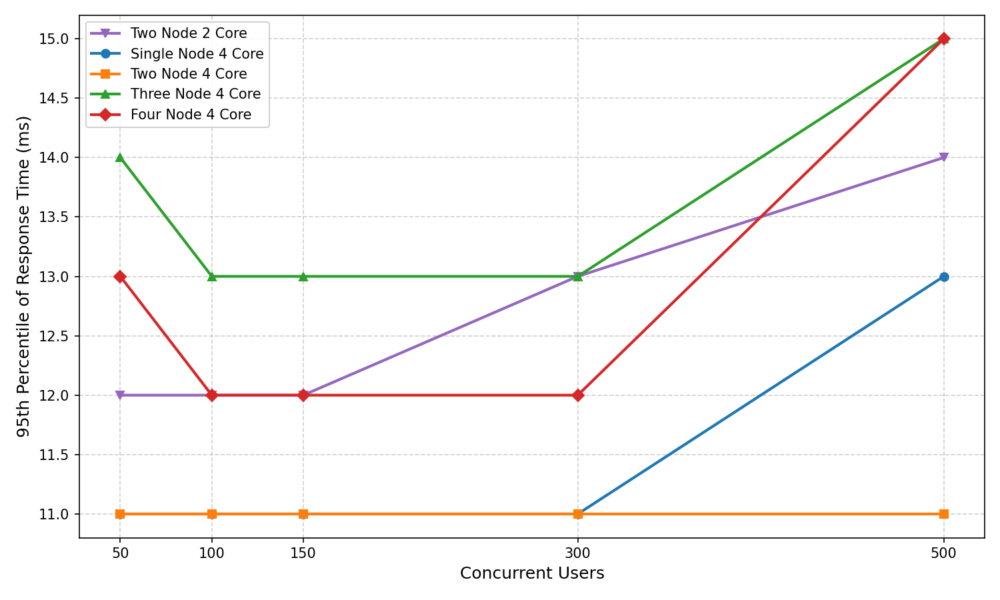

**Throughput**

<ins>Concurrency: 50 – 500</ins>

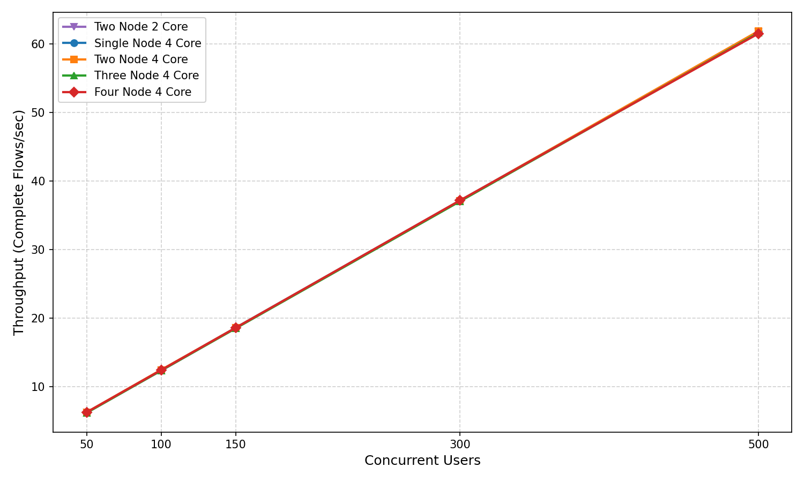

---

### 2. OIDC Auth Code Grant Redirect Without Consent

#### Obtain an access token and an id token using the OAuth 2.0 authorization code grant type without consent.

This scenario involves **4 sequential HTTP request steps**. The consent step is omitted as the OAuth
application is pre-approved.

| Step | Description |
|---|---|
| 1. Authorize Endpoint Request | Initiates the authorization flow. |
| **2. Credential Submission** ✦ | The user submits their username and password. This is the primary bottleneck step under load. |
| 3. Authorization Callback | The server validates credentials and issues an authorization code directly (no consent required). |
| 4. Token Request | Exchanges the authorization code for an access token and ID token. |

> A random think-time delay is applied before credential submission. Throughput represents
> **complete 4-step flows per second**.

**Performance Comparison with 95th Percentile of Response Time (ms) — Credential Submission Step ✦**

Concurrent Users | Two Node 2 Core | Single Node 4 Core | Two Node 4 Core | Three Node 4 Core | Four Node 4 Core
---|---|---|---|---|---
50 | 33 | 33 | 33 | 38 | 37
100 | 50 | 33 | 33 | 38 | 36
150 | 44 | 27 | 26 | 32 | 30
300 | 46 | 28 | 26 | 32 | 29
500 | 437 | 35 | 31 | 42 | 42

**Throughput Comparison (Complete Flows/sec) — Credential Submission Step ✦**

Concurrent Users | Two Node 2 Core | Single Node 4 Core | Two Node 4 Core | Three Node 4 Core | Four Node 4 Core
---|---|---|---|---|---
50 | 8.20 | 8.27 | 8.26 | 8.17 | 8.20
100 | 16.43 | 16.44 | 16.48 | 16.40 | 16.46
150 | 24.64 | 24.68 | 24.63 | 24.65 | 24.75
300 | 49.18 | 49.50 | 49.52 | 49.43 | 49.52
500 | 80.48 | 82.38 | 82.57 | 82.15 | 82.20

> **Scaling insight**: 2N2C tracks the 4-core configurations up to 300 users — at most 20 ms higher
> on response time and within 1% on throughput, since think time still paces the flow. At **500 users it
> breaks down**: the credential submission step jumps to **437 ms**, roughly **14× the Two Node 4
> Core figure**, and throughput falls 2% below the 4-core configurations as the cluster can no longer
> keep up with the client's pacing. This is the first scenario where 2-core nodes fail within the
> measured range.

**95th Percentile of Response Time**

<ins>Concurrency: 50 – 500</ins>

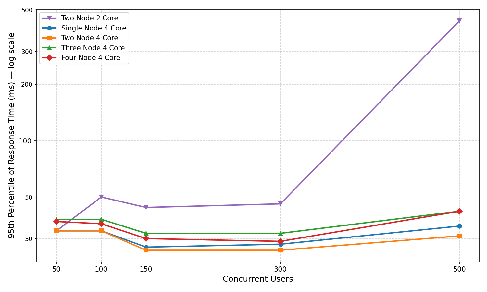

**Throughput**

<ins>Concurrency: 50 – 500</ins>

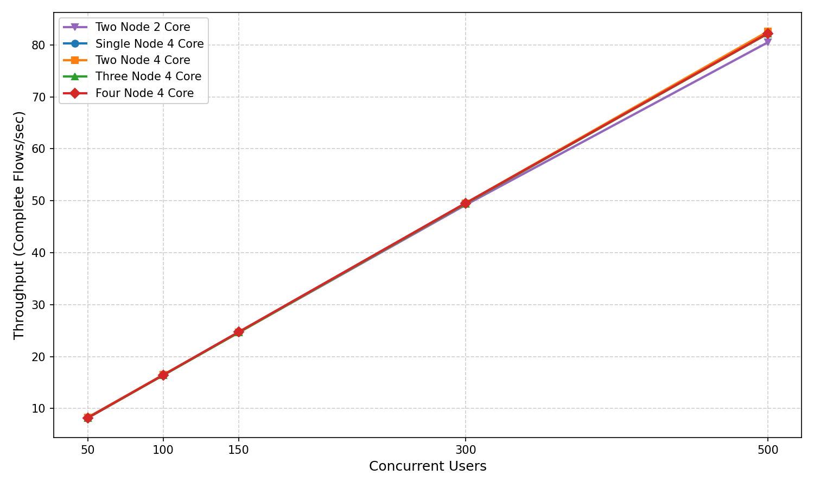

---

### 3. OIDC Auth Code Grant Redirect Without Consent Retrieving User Attributes

#### Obtain an access token and an id token without consent, while retrieving country, email, first name, and last name as user attributes.

This scenario follows the same **4 sequential HTTP request steps** as Scenario 2, with additional
user attribute retrieval during token issuance.

| Step | Description |
|---|---|
| 1. Authorize Endpoint Request | Initiates the authorization flow. |
| **2. Credential Submission** ✦ | The user submits their username and password. This is the primary bottleneck step under load. |
| 3. Authorization Callback | Validates credentials, fetches user attributes (country, email, first name, last name), and issues an authorization code. |
| 4. Token Request | Issues access and ID tokens with embedded user attributes. |

> A random think-time delay is applied before credential submission. Throughput represents
> **complete 4-step flows per second**.

**Performance Comparison with 95th Percentile of Response Time (ms) — Credential Submission Step ✦**

Concurrent Users | Two Node 2 Core | Single Node 4 Core | Two Node 4 Core | Three Node 4 Core | Four Node 4 Core
---|---|---|---|---|---
50 | 35 | 28 | 28 | 34 | 33
100 | 44 | 27 | 26 | 33 | 30
150 | 44 | 27 | 26 | 32 | 30
300 | 46 | 28 | 26 | 32 | 29
500 | 435 | 30 | 26 | 37 | 39

**Throughput Comparison (Complete Flows/sec) — Credential Submission Step ✦**

Concurrent Users | Two Node 2 Core | Single Node 4 Core | Two Node 4 Core | Three Node 4 Core | Four Node 4 Core
---|---|---|---|---|---
50 | 8.18 | 8.23 | 8.26 | 8.20 | 8.23
100 | 16.43 | 16.47 | 16.41 | 16.40 | 16.51
150 | 24.63 | 24.68 | 24.60 | 24.70 | 24.86
300 | 49.18 | 49.41 | 49.55 | 49.59 | 49.30
500 | 80.30 | 82.29 | 82.28 | 82.16 | 81.98

> **Scaling insight**: attribute retrieval costs 2N2C almost nothing relative to Scenario 2 — the
> same 44 – 46 ms band through 300 users and the same collapse to **435 ms at 500 users**. The
> attribute lookup is not what limits a 2-core node; the authentication rate is.

**95th Percentile of Response Time**

<ins>Concurrency: 50 – 500</ins>

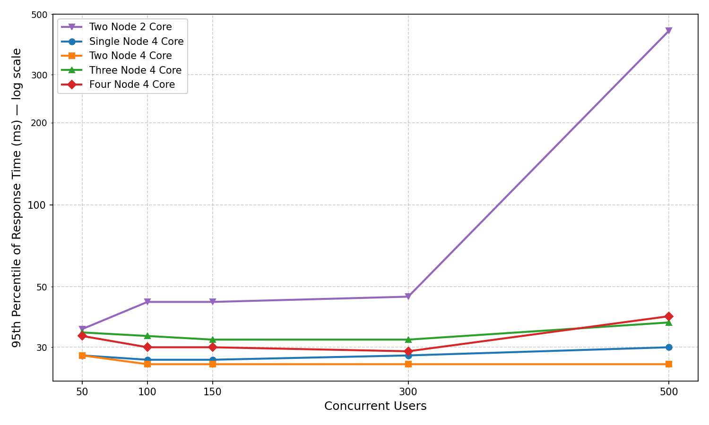

**Throughput**

<ins>Concurrency: 50 – 500</ins>

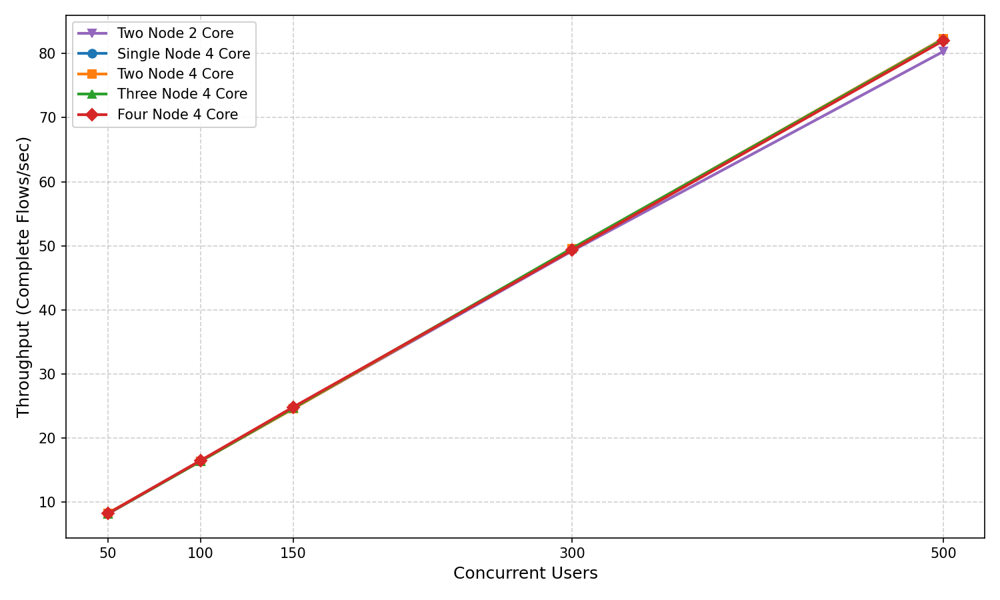

---

### 4. OIDC Auth Code Grant Redirect Without Consent Retrieving User Attributes, Groups and Roles

#### Obtain an access token and an id token without consent, retrieving user attributes along with group memberships and role assignments.

This scenario extends Scenario 3 with the same **4 sequential HTTP request steps**, adding group and
role data retrieval.

| Step | Description |
|---|---|
| 1. Authorize Endpoint Request | Initiates the authorization flow. |
| **2. Credential Submission** ✦ | The user submits their username and password. This is the primary bottleneck step under load. |
| 3. Authorization Callback | Validates credentials, fetches user attributes (country, email, first name, last name), group memberships, and role assignments. |
| 4. Token Request | Issues access and ID tokens with embedded user attributes, groups, and roles. |

> A random think-time delay is applied before credential submission. Throughput represents
> **complete 4-step flows per second**.

**Performance Comparison with 95th Percentile of Response Time (ms) — Credential Submission Step ✦**

Concurrent Users | Two Node 2 Core | Single Node 4 Core | Two Node 4 Core | Three Node 4 Core | Four Node 4 Core
---|---|---|---|---|---
50 | 35 | 28 | 27 | 34 | 33
100 | 45 | 28 | 27 | 33 | 32
150 | 43 | 27 | 26 | 32 | 30
300 | 46 | 28 | 26 | 32 | 29
500 | 409 | 29 | 27 | 35 | 38

**Throughput Comparison (Complete Flows/sec) — Credential Submission Step ✦**

Concurrent Users | Two Node 2 Core | Single Node 4 Core | Two Node 4 Core | Three Node 4 Core | Four Node 4 Core
---|---|---|---|---|---
50 | 8.19 | 8.27 | 8.23 | 8.26 | 8.19
100 | 16.43 | 16.46 | 16.52 | 16.46 | 16.51
150 | 24.67 | 24.79 | 24.76 | 24.68 | 24.72
300 | 49.23 | 49.57 | 49.53 | 49.45 | 49.48
500 | 79.98 | 82.40 | 82.45 | 82.13 | 82.07

> **Scaling insight**: adding groups and roles on top of user attributes changes the 2N2C picture
> only marginally — **409 ms at 500 users**, slightly *better* than the 435 ms of Scenario 3, which
> is within run-to-run noise. Through 300 users the three without-consent variants are
> indistinguishable on 2-core nodes.

**95th Percentile of Response Time**

<ins>Concurrency: 50 – 500</ins>

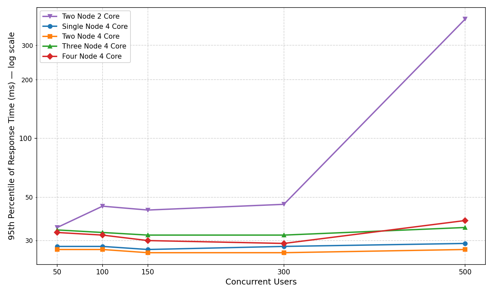

**Throughput**

<ins>Concurrency: 50 – 500</ins>

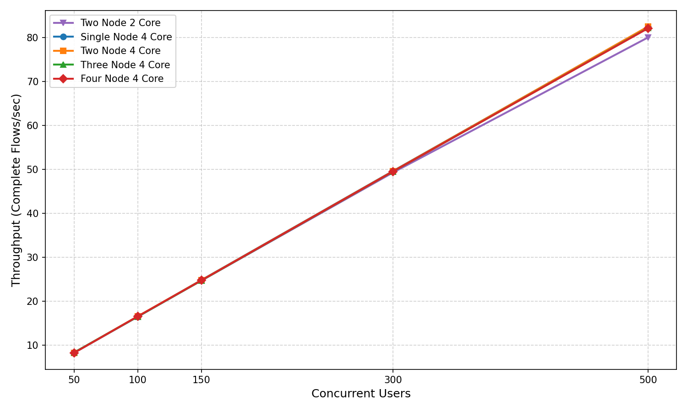

---

### 5. SAML2 SSO Redirect Binding

#### Obtain a SAML 2 assertion response using redirect binding.

This scenario involves **2 sequential HTTP request steps** that make up a complete SAML 2.0 SSO
flow:

| Step | Description |
|---|---|
| 1. Initial SAML Request | The service provider sends a SAML authentication request to the identity provider via HTTP redirect binding. |
| **2. Identity Provider Login** ✦ | The user submits their credentials to the identity provider, which validates them, generates a signed SAML assertion, and redirects back to the service provider. This is the primary bottleneck step. |

> A random think-time delay is applied before credential submission. Throughput represents
> **complete 2-step SAML flows per second**.

**Performance Comparison with 95th Percentile of Response Time (ms) — Identity Provider Login Step ✦**

Concurrent Users | Two Node 2 Core | Single Node 4 Core | Two Node 4 Core | Three Node 4 Core | Four Node 4 Core
---|---|---|---|---|---
50 | 34 | 32 | 32 | 41 | 37
100 | 42 | 31 | 32 | 39 | 34
150 | 41 | 31 | 31 | 39 | 34
300 | 41 | 31 | 31 | 38 | 33
500 | 45 | 32 | 31 | 48 | 47

**Throughput Comparison (Complete Flows/sec) — Identity Provider Login Step ✦**

Concurrent Users | Two Node 2 Core | Single Node 4 Core | Two Node 4 Core | Three Node 4 Core | Four Node 4 Core
---|---|---|---|---|---
50 | 8.26 | 8.21 | 8.31 | 8.31 | 8.25
100 | 16.59 | 16.46 | 16.55 | 16.47 | 16.56
150 | 24.72 | 24.87 | 24.86 | 24.77 | 24.79
300 | 49.48 | 49.58 | 49.79 | 49.77 | 49.54
500 | 82.58 | 82.31 | 82.27 | 82.43 | 82.22

> **Scaling insight**: this is the one interactive scenario where 2N2C holds all the way to 500
> users — **45 ms**, which is *better* than Three Node 4 Core (48 ms) and Four Node 4 Core (47 ms),
> at the highest throughput of any configuration (82.58 flows/sec). SAML redirect binding is a
> 2-step flow, so a given flow rate costs the cluster half the requests of the 4-step authorization
> code variants, and the 2-core nodes stay below their knee.

**95th Percentile of Response Time**

<ins>Concurrency: 50 – 500</ins>

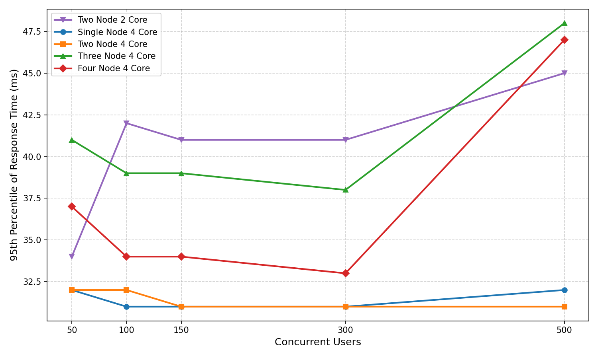

**Throughput**

<ins>Concurrency: 50 – 500</ins>

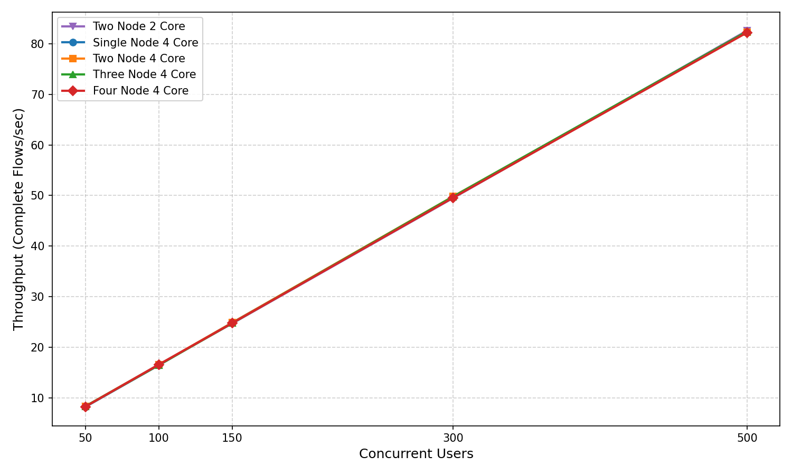

---

### 6. App Native Authentication

#### Obtain an access token and an id token using the app native authentication flow.

This scenario involves **3 sequential HTTP request steps**. Unlike browser-based redirect flows, App
Native Authentication allows the application to handle the credential exchange directly without
browser redirects:

| Step | Description |
|---|---|
| 1. Authorization Request | The application sends an authentication initiation request directly to the authorization endpoint. |
| **2. Credential Submission** ✦ | The user's credentials are submitted directly by the application. The identity provider validates them and returns an authentication result. This is the primary bottleneck step under load. |
| 3. Token Request | The application exchanges the authentication result for an access token and ID token. |

> A random think-time delay is applied before credential submission. Throughput represents
> **complete 3-step flows per second**.

**Performance Comparison with 95th Percentile of Response Time (ms) — Credential Submission Step ✦**

Concurrent Users | Two Node 2 Core | Single Node 4 Core | Two Node 4 Core | Three Node 4 Core | Four Node 4 Core
---|---|---|---|---|---
50 | 43 | 38 | 38 | 46 | 44
100 | 58 | 37 | 37 | 45 | 42
150 | 57 | 37 | 37 | 44 | 41
300 | 61 | 38 | 36 | 44 | 40
500 | 465 | 41 | 36 | 53 | 47

**Throughput Comparison (Complete Flows/sec) — Credential Submission Step ✦**

Concurrent Users | Two Node 2 Core | Single Node 4 Core | Two Node 4 Core | Three Node 4 Core | Four Node 4 Core
---|---|---|---|---|---
50 | 8.33 | 8.28 | 8.30 | 8.21 | 8.29
100 | 16.42 | 16.48 | 16.54 | 16.39 | 16.45
150 | 24.55 | 24.70 | 24.66 | 24.73 | 24.61
300 | 49.12 | 49.51 | 49.47 | 49.41 | 49.40
500 | 80.19 | 82.43 | 82.40 | 82.05 | 82.29

> **Scaling insight**: App Native is the most expensive step-wise flow for 2-core nodes — 57 – 61 ms
> through 300 users, roughly 1.4 – 1.7× the 4-core figures, and **465 ms at 500 users**, the largest
> response time of any interactive scenario in this document.

**95th Percentile of Response Time**

<ins>Concurrency: 50 – 500</ins>

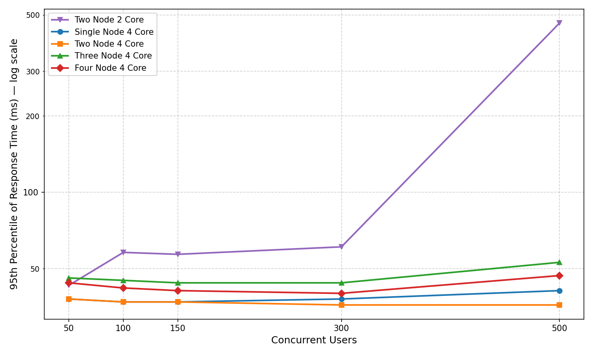

**Throughput**

<ins>Concurrency: 50 – 500</ins>

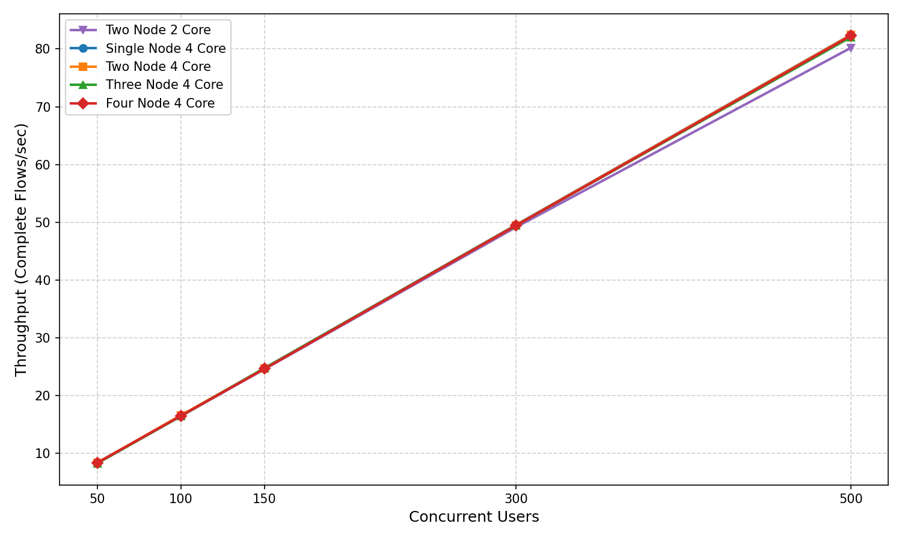

---

### 7. Token Exchange Grant Type

#### Obtain an access token and an id token using the OAuth 2.0 token exchange grant type.

This is a **single-step machine-to-machine flow**. A client presents an existing subject token and
exchanges it for a new access token with a different audience or scope. There is no user
interaction, and therefore no think time — the load is server-bound throughout and the deployments
separate immediately.

**Performance Comparison with 95th Percentile of Response Time (ms)**

Concurrent Users | Two Node 2 Core | Single Node 4 Core | Two Node 4 Core | Three Node 4 Core | Four Node 4 Core
---|---|---|---|---|---
50 | 277 | 153 | 191 | 173 | 174
100 | 755 | 329 | 275 | 293 | 257
150 | 1175 | 511 | 381 | 381 | 307
300 | 2415 | 1063 | 811 | 699 | 489
500 | 4127 | 1759 | 1615 | 1591 | 1423

**Throughput Comparison (Requests/sec)**

Concurrent Users | Two Node 2 Core | Single Node 4 Core | Two Node 4 Core | Three Node 4 Core | Four Node 4 Core
---|---|---|---|---|---
50 | 458.58 | 492.38 | 714.29 | 825.92 | 853.73
100 | 367.84 | 475.99 | 768.87 | 911.09 | 897.57
150 | 354.06 | 468.43 | 819.55 | 961.73 | 1019.76
300 | 344.86 | 454.03 | 846.67 | 1059.51 | 1171.01
500 | 335.51 | 454.53 | 888.77 | 1090.21 | 1479.01

> **Scaling insight**: 2N2C sustains **336 – 459 req/s**, i.e. 36 – 62% below Two Node 4 Core.
> Throughput peaks at the lowest measured concurrency and **declines 27% by 500 users**, while every
> 4-core configuration holds flat or rises — the 2-core nodes are already past their knee at 50
> users. The 95th percentile reaches **4127 ms at 500 users**, 2.6× the Two Node 4 Core figure.

**95th Percentile of Response Time**

<ins>Concurrency: 50 – 500</ins>

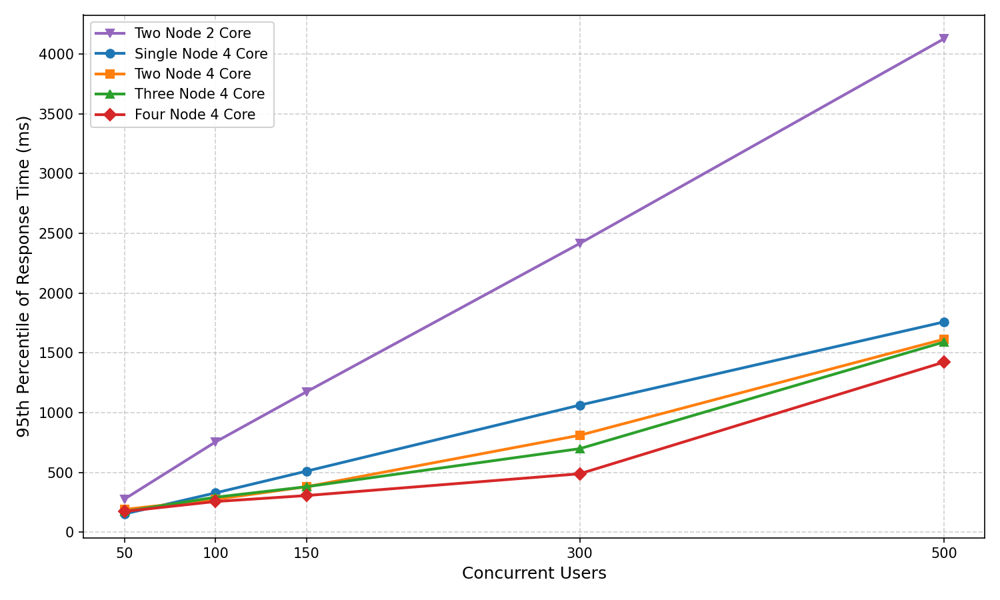

**Throughput**

<ins>Concurrency: 50 – 500</ins>

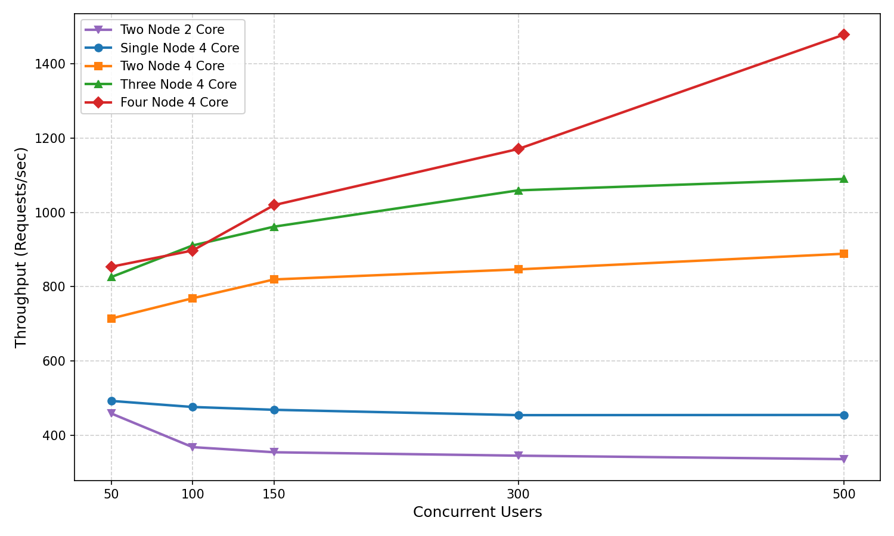

---

### 8. Client Credentials Grant Type

#### Obtain an access token using the OAuth 2.0 client credentials grant type.

This is a **single-step machine-to-machine flow**. A client application authenticates directly using
its client ID and secret at the `/token` endpoint, with no user involvement. Because there is no
think time, the load is server-bound throughout and the deployments separate immediately.

**Performance Comparison with 95th Percentile of Response Time (ms)**

Concurrent Users | Two Node 2 Core | Single Node 4 Core | Two Node 4 Core | Three Node 4 Core | Four Node 4 Core
---|---|---|---|---|---
50 | 147 | 74 | 51 | 35 | 25
100 | 469 | 138 | 194 | 118 | 50
150 | 751 | 203 | 373 | 243 | 126
300 | 1679 | 429 | 819 | 575 | 287
500 | 2495 | 783 | 1295 | 951 | 385

**Throughput Comparison (Requests/sec)**

Concurrent Users | Two Node 2 Core | Single Node 4 Core | Two Node 4 Core | Three Node 4 Core | Four Node 4 Core
---|---|---|---|---|---
50 | 905.66 | 1084.13 | 1750.07 | 2538.89 | 2856.20
100 | 754.67 | 1056.18 | 1744.60 | 2627.19 | 2927.64
150 | 752.65 | 1023.38 | 1896.92 | 2398.75 | 2949.31
300 | 710.08 | 990.67 | 1739.69 | 2638.63 | 2981.62
500 | 681.38 | 970.82 | 1868.69 | 2553.60 | 3014.67

> **Scaling insight**: 2N2C sustains **681 – 906 req/s**, i.e. 48 – 64% below Two Node 4 Core. That
> is slightly worse than linear for halving the cores per node — 2N2C delivers 36 – 52% of the 2N4C
> rate where proportional scaling would predict 50%. Throughput also **declines 25%** across the
> range (906 req/s at 50 users down to 681 req/s at 500), indicating the 2-core nodes are already
> saturated at the bottom of this range.

**95th Percentile of Response Time**

<ins>Concurrency: 50 – 500</ins>

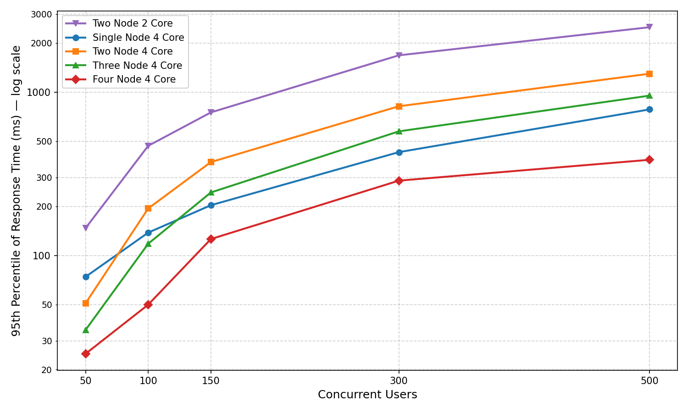

**Throughput**

<ins>Concurrency: 50 – 500</ins>

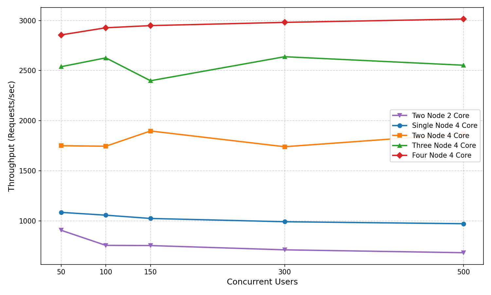

---

### 9. OIDC Password Grant Type

#### Obtain an access token and an id token using the OAuth 2.0 password grant type.

This is a **single-step flow** where the user's credentials are passed directly to the `/token`
endpoint by the client application. This grant type places more processing load on the identity
provider, as it must validate credentials and issue tokens in a single request.

**Performance Comparison with 95th Percentile of Response Time (ms)**

Concurrent Users | Two Node 2 Core | Single Node 4 Core | Two Node 4 Core | Three Node 4 Core | Four Node 4 Core
---|---|---|---|---|---
50 | 245 | 157 | 177 | 182 | 183
100 | 675 | 289 | 291 | 236 | 233
150 | 1039 | 455 | 421 | 297 | 303
300 | 2207 | 955 | 879 | 543 | 419
500 | 4079 | 1559 | 1479 | 1423 | 1351

**Throughput Comparison (Requests/sec)**

Concurrent Users | Two Node 2 Core | Single Node 4 Core | Two Node 4 Core | Three Node 4 Core | Four Node 4 Core
---|---|---|---|---|---
50 | 416.41 | 457.94 | 708.97 | 858.93 | 934.63
100 | 328.42 | 430.68 | 752.24 | 953.06 | 1043.80
150 | 327.70 | 400.10 | 778.25 | 1002.80 | 1089.76
300 | 320.14 | 388.98 | 772.03 | 1099.88 | 1232.87
500 | 293.44 | 401.99 | 793.72 | 1166.76 | 1551.69

> **Scaling insight**: 2N2C peaks at **416 req/s** and degrades to 293 req/s by 500 concurrent
> users, 41 – 63% below Two Node 4 Core. The 95th percentile reaches **4079 ms at 500 users** —
> 2.8× the Two Node 4 Core figure — so the password grant is the least forgiving of the
> machine-to-machine grants on 2-core nodes.

**95th Percentile of Response Time**

<ins>Concurrency: 50 – 500</ins>

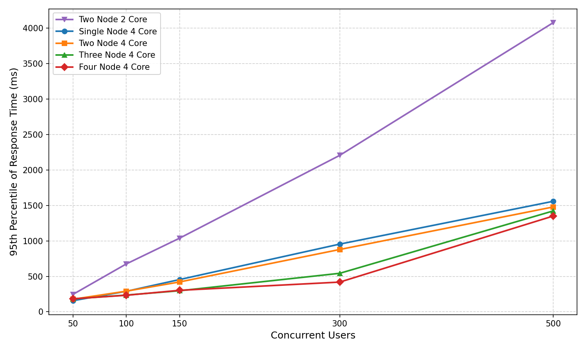

**Throughput**

<ins>Concurrency: 50 – 500</ins>

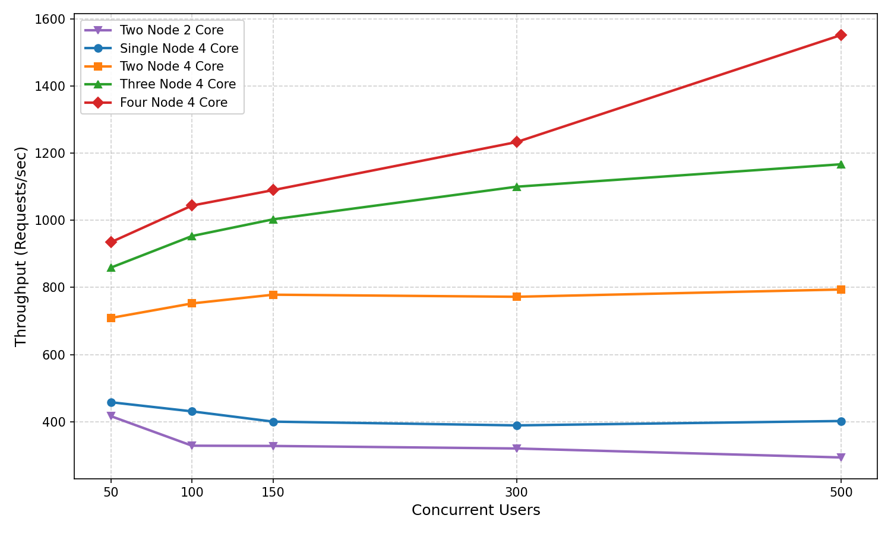

---

## Scaling observations

**Scale-up beat scale-out at equal total core count.** Two Node 2 Core and Single Node 4 Core both
provide four vCPUs in total, but the single 4-core node was faster on all three machine-to-machine
grants:

| Scenario | Metric at 500 users | Two Node 2 Core | Single Node 4 Core | Difference |
|---|---|---|---|---|
| Client Credentials | Throughput (req/s) | 681.38 | 970.82 | 2N2C 29.8% lower |
| Client Credentials | 95th percentile (ms) | 2495 | 783 | 2N2C 3.2× higher |
| Token Exchange | Throughput (req/s) | 335.51 | 454.53 | 2N2C 26.2% lower |
| Token Exchange | 95th percentile (ms) | 4127 | 1759 | 2N2C 2.3× higher |
| OIDC Password Grant | Throughput (req/s) | 293.44 | 401.99 | 2N2C 27.0% lower |
| OIDC Password Grant | 95th percentile (ms) | 4079 | 1559 | 2N2C 2.6× higher |

Across the 50 – 500 range 2N2C returned 7 – 30% less throughput than 1N4C at matched core count, so
splitting four cores across two nodes cost throughput rather than adding it. Clustering overhead and
per-node capacity limits are the likely causes; this is a small set of runs, not a controlled
scale-up-versus-scale-out study, so treat the direction as indicative.

**Two cores per node saturate early on machine-to-machine grants.** On all three single-step grants
2N2C throughput peaks at the lowest measured concurrency (50 users) and falls from there — down 25%
by 500 users on Client Credentials, 27% on Token Exchange and 30% on the Password Grant. Single Node
4 Core shows the same shape but shallower (down 8 – 12%), while the multi-node 4-core configurations
hold flat or rise. A 2-core node has little headroom left even at 50 concurrent users for these
grant types.

**Interactive flows hold to 300 users, then four of six cliff at 500.** Through 300 concurrent users
every redirect-based scenario on 2N2C is at most 25 ms slower than the fastest 4-core configuration
and within 1% on throughput, because client think time — not server capacity — paces the flow. At 500
users that stops being true for the three without-consent variants (409 – 437 ms) and App Native
Authentication (465 ms), each roughly 13 – 17× the Two Node 4 Core figure, with throughput slipping
2 – 3% below the pace the 4-core clusters still hold.

**What survives 500 users is a function of requests per flow.** The two interactive scenarios that
do *not* cliff are the ones that ask least of the cluster per unit of user-visible progress:

| Scenario | Steps per flow | Flows/sec at 500 users | Resulting request rate | 95th percentile |
|---|---|---|---|---|
| SAML2 SSO Redirect Binding | 2 | 82.58 | ~165 req/s | 45 ms |
| Auth Code With Consent | 5 | 61.77 | ~309 req/s | 14 ms |
| App Native Authentication | 3 | 80.19 | ~241 req/s | 465 ms |
| Auth Code Without Consent | 4 | 80.48 | ~322 req/s | 437 ms |

SAML stays well under the cluster's knee. The with-consent flow carries an extra think-time pause,
so at 500 users it performs about 62 authentications per second against roughly 80 for the
without-consent variants — the 2-core knee sits between those two authentication rates, which is why
adding the consent step makes the flow *more* tolerant rather than less.

**Capacity guidance.** For 7.3.0 on 2-core nodes, a two-node cluster is adequate for interactive
browser-based authentication up to roughly 300 concurrent users, and for SAML redirect binding
through 500. Machine-to-machine grants are the limiting case: budget for roughly 290 – 460 req/s on
the password and token-exchange grants and 680 – 910 req/s on client credentials. Expect 95th
percentile latencies above one second from 150 concurrent users on the password and token-exchange
grants, and above two seconds on all three by 500. Where those rates matter, four cores on one node
beat two cores on each of two nodes.
